# 3Chat 功能复刻：技术架构、实现手段与落地路线

> 版本：2026-08-13<br>
> 适用仓库：`E:\zhinengkefu\desktop`<br>
> 前置事实报告：`3CHAT_WEIXIN_CHANNEL_RESEARCH_20260813.md`<br>
> 目标：复刻 3Chat 的用户可见功能与业务逻辑，同时把微信个人号、微信 iLink、托管企业微信成员号、企业微信官方微信客服拆成独立渠道，不把未授权私有协议伪装成可直接开发的官方接口。

### 0.1 关于“授权”的更正

本报告**不认定 3Chat 的个人微信托管或企业微信成员号托管获得了腾讯/微信官方接口授权**。按用户补充的事实和当前公开证据，后文统一采用以下判断：

- 3Chat 个人微信：非微信开放平台个人号消息 API，而是第三方云端 PAD/iPad 客户端登录态托管；
- 3Chat 企业微信成员号：非企业微信官方成员消息 API，而是 Workeasy/Workmate 类 Mac/iPad 客户端登录态托管；
- 扫码、账号本人同意登录或完成实名，只表示账号持有人参与登录，不等于腾讯向服务商开放了官方接口；
- 供应商愿意提供 HTTP API，也只表示供应商向 3Chat 开放其聚合接口，不等于该接口获得腾讯官方认可；
- 只有企业微信“微信客服”第三方应用授权链路，以及腾讯公开发布的 iLink 插件，可以分别按其官方公开契约讨论。

公开材料可以确认前两条链路呈现为非官方客户端托管形态；但仅凭公开网页无法证明某家公司绝对不存在任何未公开商务关系。因此本文使用严谨表述：**未发现腾讯官方授权证据，且技术形态不是官方个人号/成员消息 API**。

## 0. 先给结论

3Chat 不是“一个大模型接一个微信接口”，而是五层系统的组合：

1. **渠道设备层**：官方 API、iLink Bot、云端 iPad/PAD、云端 Mac/iPad 企微客户端或 Android 真机；
2. **消息可靠性层**：登录状态、游标、回调验签、幂等、重试、发送队列、最终回执；
3. **会话编排层**：连续消息合并、群聊触发、客户身份、人工接管、冷却恢复、回复拆段；
4. **Agent 层**：意图路由、知识检索、工具调用、流程技能、回复策略、安全审核；
5. **运营控制面**：收件箱、Agent Builder、知识库、测试集、版本发布、账号健康、审计与指标。

要达到 3Chat 的功能效果，最可靠的复刻方式不是破解微信客户端协议，而是：

- **企业微信生产主通道**：继续使用仓库已经实现的企业微信官方“微信客服”API；
- **微信 Bot 实验通道**：直接复用腾讯公开的 `Tencent/openclaw-weixin` iLink 实现，不重写协议；
- **个人微信完整能力**：采购具有合同、正式 API、回调与账号风控服务的云端 PAD/iPad 托管上游，再做适配器；
- **企业微信成员号完整能力**：采购 Workeasy/Workmate 类托管上游，再做适配器；
- **本地真机 RPA**：只用于没有开放 API 的外围平台或受控实验，不作为个人微信生产主链路。

最终应形成“一个 Agent 控制面 + 四种微信/企微适配器”，而不是四套客服系统。

## 1. 证据边界与复刻边界

### 1.1 已确认可以复刻

- 统一收件箱、会话时间线、客户画像；
- Agent 路由、知识库、技能与工具调用；
- 连续消息合并、自然回复拆段、延迟与输入状态；
- 会话级和客户级人工接管；
- 群聊中的 `@`、引用、客户消息与同事消息区分；
- 异步发送队列、幂等、重试、未知送达状态、最终回执；
- Agent Builder 的草稿、测试、评估、发布和回滚；
- 企业微信官方微信客服的真实收发；
- iLink 公开 Bot 协议的登录、收消息、发送和媒体；
- 托管上游已公开 API 范围内的账号、联系人、群聊、朋友圈、群发和消息回调。

### 1.2 不能靠猜测复刻

- 微信个人号客户端私有协议、密钥交换与设备指纹；
- Workeasy/Workmate 的底层客户端协议；
- 3Chat 与其托管上游之间没有公开的内部签名算法、重试语义和风控参数；
- 任何未取得合同、API 文档、测试租户和回调签名规则的托管服务；
- 朋友圈、群发、拉群等高风险动作在真实账号上的安全阈值；
- 仅凭 HTTP 200 推断手机端最终收到消息。

这些部分如要实现同等功能，工程上只能选择购买第三方托管服务并取得其合同、API 使用权和测试账号，再实现稳定适配器；这仍然不应表述为取得腾讯官方授权。另一条路线是只使用腾讯/企业微信已经公开的官方能力。本文不提供伪造设备、绕过风控或复制私有客户端协议的实现步骤。

## 2. 目标总体架构

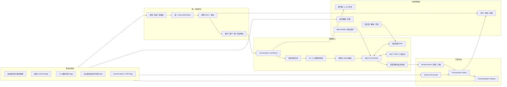

### 2.1 核心设计原则

- 渠道只能提供“事实”，不能决定业务回复；
- Agent 只能生成“发送意图”，不能直接调用渠道；
- 所有入站先持久化再处理；
- 所有出站先入 Outbox 再发送；
- 每个账号、会话和客户身份都必须隔离；
- `accepted`、`sent`、`delivered`、`read` 是不同状态；
- 人工接管状态必须在调用大模型之前检查，在真正发送之前再次检查；
- 私有托管通道可以替换，客服核心不能绑定供应商字段。

## 3. 部署拓扑

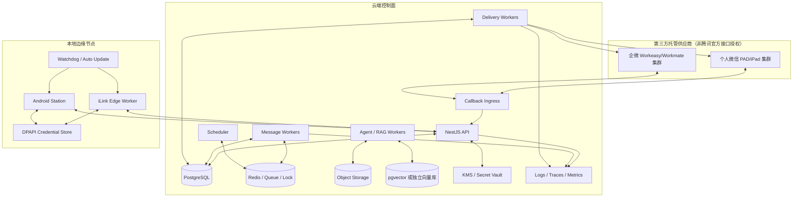

### 3.1 为什么 iLink 建议独立 Edge Worker

iLink 是 35 秒左右的长轮询、二维码登录和本地凭据模型。把它直接塞进 Web API 进程会造成：

- API 重启导致长轮询中断；
- 多副本同时消费同一账号游标；
- 登录 token 与业务数据库混放；
- 一个账号网络异常拖慢整个 API；
- 难以做账号级进程隔离和热更新。

因此每个 iLink 账号由一个租约所有者消费，凭据保存在 Edge 的 DPAPI 或云端 KMS 中，云端只接收标准消息信封。

### 3.2 基础设施最小组合

| 能力 | MVP | 生产建议 |
|---|---|---|
| 关系数据 | 现有 PostgreSQL / Prisma | PostgreSQL 高可用 |
| 队列 | 数据库轮询 | Redis Streams、BullMQ 或 Kafka |
| 分布式锁 | PostgreSQL advisory lock | Redis Redlock + DB fencing token |
| 对象存储 | 当前 StorageService | S3 兼容对象存储 + 病毒扫描 |
| 向量检索 | PostgreSQL + pgvector | pgvector 起步，规模后可替换 Qdrant |
| 关键词检索 | PostgreSQL FTS | OpenSearch / Elasticsearch |
| 密钥 | 环境变量开发模式 | KMS/Vault，Edge 使用 DPAPI |
| 可观测 | 结构化日志 | OpenTelemetry + Prometheus + 告警 |

## 4. 统一渠道契约

渠道适配器必须只有标准输入输出，不允许业务层读取供应商原始 JSON。

```ts
export type ChannelKind =
  | "wecom_kf"
  | "weixin_ilink"
  | "hosted_personal_wechat"
  | "hosted_wecom_member"
  | "android_rpa";

export type PeerKind = "direct" | "group" | "customer_service";

export interface InboundEnvelope {
  schemaVersion: 1;
  channel: ChannelKind;
  tenantId: string;
  accountExternalId: string;
  eventId: string;
  messageId: string;
  occurredAt: string;
  receivedAt: string;
  peer: {
    kind: PeerKind;
    externalId: string;
    title?: string;
  };
  sender: {
    externalId: string;
    displayName?: string;
    role: "customer" | "employee" | "self" | "bot" | "unknown";
  };
  content: Array<
    | { type: "text"; text: string }
    | { type: "image"; mediaRef: string; mime?: string }
    | { type: "voice"; mediaRef: string; durationMs?: number }
    | { type: "video"; mediaRef: string }
    | { type: "file"; mediaRef: string; fileName?: string }
    | { type: "location"; latitude: number; longitude: number; label?: string }
  >;
  quote?: { messageId?: string; senderExternalId?: string; text?: string };
  mentions?: Array<{ externalId?: string; displayName?: string; isSelf?: boolean }>;
  replyContext?: {
    tokenRef?: string;
    expiresAt?: string;
  };
  cursor?: string;
  rawObjectRef: string;
}

export interface OutboundCommand {
  commandId: string;
  idempotencyKey: string;
  channel: ChannelKind;
  tenantId: string;
  accountId: string;
  conversationId: string;
  peerExternalId: string;
  replyContextRef?: string;
  parts: Array<
    | { type: "text"; text: string }
    | { type: "image"; assetId: string }
    | { type: "file"; assetId: string; fileName: string }
  >;
  policySnapshot: {
    handoffVersion: number;
    manualLocked: boolean;
    consentScope?: string;
    sendWindow?: string;
  };
  deadlineAt?: string;
}

export type DeliveryState =
  | "queued"
  | "dispatching"
  | "accepted"
  | "sent"
  | "delivered"
  | "read"
  | "retryable_failed"
  | "permanent_failed"
  | "unknown"
  | "cancelled";

export interface DeliveryReceipt {
  channel: ChannelKind;
  commandId: string;
  providerMessageId?: string;
  state: DeliveryState;
  providerCode?: string;
  occurredAt: string;
  retrySafe: boolean;
  rawObjectRef?: string;
}

export interface ChannelCapabilities {
  receive: Array<"text" | "image" | "voice" | "video" | "file" | "quote" | "mention">;
  send: Array<"text" | "image" | "voice" | "video" | "file" | "card">;
  group: boolean;
  proactiveMessage: "supported" | "window_limited" | "context_limited" | "unsupported" | "unknown";
  finalDeliveryReceipt: boolean;
  contacts: boolean;
  moments: boolean;
  broadcast: boolean;
  humanMobileCoexistence: boolean;
}

export interface ChannelAdapter {
  readonly kind: ChannelKind;
  capabilities(accountId: string): Promise<ChannelCapabilities>;
  accountHealth(accountId: string): Promise<AccountHealth>;
  send(command: OutboundCommand): Promise<DeliveryReceipt>;
  reconcile?(accountId: string, cursor?: string): Promise<DeliveryReceipt[]>;
}
```

### 4.1 契约中的关键点

- `rawObjectRef` 指向加密存储的原始事件，业务表不直接保存任意供应商 JSON；
- `eventId` 用于事件幂等，`messageId` 用于消息幂等，二者不能混用；
- `replyContext.tokenRef` 保存 iLink `context_token` 的引用，而不是把 token 写入普通日志；
- `policySnapshot` 防止排队后人工接管状态变化仍然误发；
- `DeliveryReceipt` 允许供应商没有最终回执时落为 `unknown`，不能强行标记 `sent`；
- `ChannelCapabilities` 由账号实测能力生成，不能只由渠道名称硬编码。

## 5. 四条核心渠道的复刻手段

## 5.1 企业微信官方微信客服：生产基线

### 已确认链路

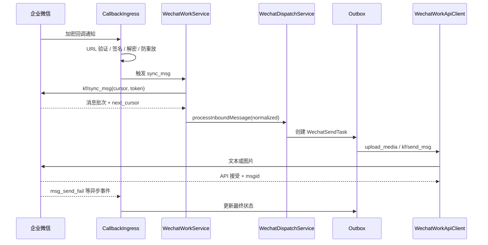

### 当前仓库可直接复用

- `WechatWorkService.verifyCallback`、`handleCallback`；
- `syncCustomerServiceMessages`、`runCustomerServiceSync`；
- `WechatWorkApiClient.syncMessages`、`sendText`、`uploadImage`、`sendImage`；
- `WechatDispatchService.processInboundMessage`；
- `WechatSendTask`、`WechatSendAttempt`；
- `completeWechatWorkKfSend`、`settleWechatWorkAsyncFailure`；
- `WechatWorkBinding`、`WechatWorkSyncCursor`、审计日志。

### 需要补强

1. 用统一 `InboundEnvelope` 包装现有同步消息；
2. 把 `wechat_work_kf` 从 `WechatSendAdapterService` 的条件分支迁移成独立适配器类；
3. 让 `msg_send_fail` 等回调统一进入 `DeliveryReconciler`；
4. 收件箱显示 `accepted` 与最终送达的区别；
5. 配置真实企业凭据、公网 HTTPS 回调和正式 `WECHAT_SEND_ADAPTER=wechat_work_kf`；
6. 在真实授权账号完成收、回、异步失败、窗口限制和手机端送达验收。

### 产品差异

它能稳定复刻“微信客服”，但不能假装成企业微信成员个人号，也不天然拥有成员通讯录、朋友圈、客户群和手机成员号会话的全部能力。

## 5.2 微信 iLink Bot：公开协议路线

### 已确认协议

腾讯公开仓库给出的核心是：

- 扫码登录并保存 bot token；
- `getupdates` 长轮询，传入上次的 `get_updates_buf`；
- 入站消息包含 `from_user_id`、`message_id`、`item_list` 与 `context_token`；
- `sendmessage` 回复时回传目标用户和 `context_token`；
- `getuploadurl` 获取媒体上传参数；
- 图片、视频和文件媒体通过 CDN 传输，使用 AES-128-ECB；
- `getconfig` / `sendtyping` 提供输入状态；
- 多账号应按 `account + channel + peer` 隔离会话。

### 复刻方式

**复用腾讯插件代码或作为独立依赖，不照着文档重新写一套协议。** 在其外面增加 `IlinkEdgeWorker`：

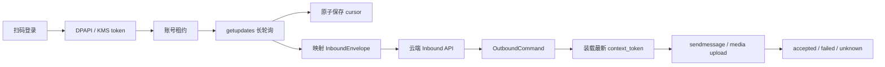

### 必须实现的可靠性细节

- 每个账号同时只能有一个活跃长轮询租约；
- 保存 cursor 与消息入库必须保证“至少一次 + 幂等”，不能先提交 cursor 再丢消息；
- `context_token` 按 `account + peer` 保存，带产生时间和最后使用时间；
- 发送前检查 token 是否存在；发送非零 `ret` 必须失败，不能静默吞掉；
- `-14` 等 stale token 状态触发重新登录或健康降级；
- GitHub issue 中“约 48 小时”的上下文有效期只是实测报告，不应硬编码为官方 SLA；
- 长任务先发送进度提示或异步任务卡片，最终回复不能无限依赖老的上下文 token；
- 媒体先校验类型、大小、MD5，再加密上传；临时明文与密钥及时清除；
- 群聊能力必须通过测试账号实测后再开启 `capabilities.group`，不能仅凭 UI 声称支持。

### iLink 不能替代什么

- 不能直接证明拥有个人微信主站托管的朋友圈、群发和手机端人工接管；
- 不能替代成员型企业微信；
- 不能读取本机微信历史数据库；
- 不能把社区问题中的经验时效当正式服务保证。

## 5.3 个人微信云端 PAD/iPad 托管：主站个人号路线

### 已确认的产品形态

3Chat 2026-04 的公开教程显示这是一套按端口租用的云端设备登录：

- 选择 PAD/iPad 登录类型与地区；
- 购买端口并扫码登录；
- 可能触发新设备实名与人脸辅助；
- 后端约 3–5 分钟同步和检查；
- 新绑定存在冷却期、首周掉线和账号风控；
- 后续由托管控制面向 3Chat 回调消息和账号事件；
- Beta 阶段的群聊、企业微信联系人回复等能力有版本边界。

### 正确复刻方式

不自行实现微信私有客户端协议。先选择上游并取得：

1. 企业合同和账号责任边界；
2. 完整 API 文档与测试环境；
3. 消息回调签名与重放规则；
4. 登录、二维码、实名状态机；
5. 联系人、群、消息、媒体、朋友圈、群发接口；
6. 发送回执、失败码和主动查询接口；
7. 账号离线、挤线、过期、风险状态回调；
8. 数据留存、删除、地域与生物信息处理说明；
9. 限速、并发、消息窗口和风控政策；
10. SLA、封号责任、供应商退出与数据迁移条款。

获得这些前置条件后实现 `HostedPersonalWechatAdapter`，而不是把供应商字段扩散到业务层。

### 适配器内部组件

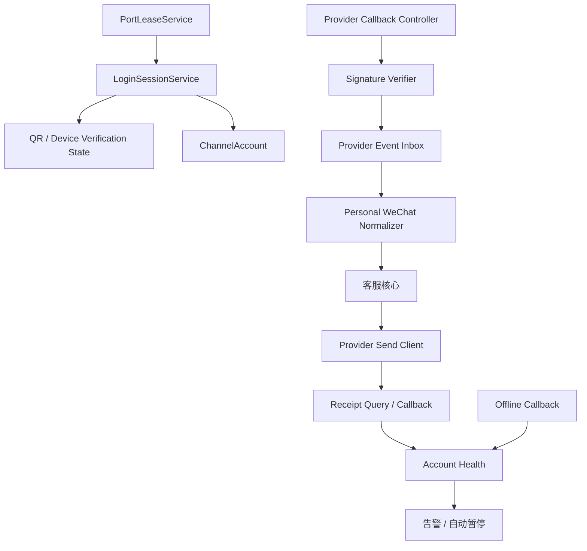

### 账号状态机

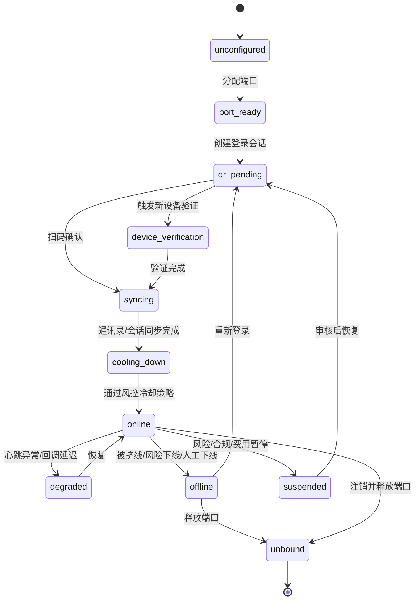

### 严禁复刻的部分

- 不复制公开 APK 中的硬编码密钥；
- 不采集、代理或长期保存身份证与人脸原始数据；
- 不在自己的服务端伪造设备指纹；
- 不把供应商的登录辅助 APK 当作我方客户端发布；
- 不承诺规避微信风控或保证不封号。

## 5.4 托管企业微信成员号：Workeasy / Workmate 路线

### 已确认形态

3Chat 公开教程明确区分：

- Workeasy：模拟/托管 Mac 客户端身份，不能与企业微信 PC 客户端同时在线；
- Workmate：模拟/托管 iPad 客户端身份，可以与 PC 同时在线，但不能与真实 iPad 同时在线；
- 首次托管可能触发企业微信实名验证；
- 上游聚合 API 提供消息、联系人、客户群、群发、朋友圈或营销任务能力；
- 3Chat 设置消息回调与账号托管事件回调，再由其 Agent 处理。

### 正确复刻方式

与个人号托管相同：采购上游能力，做 `HostedWecomMemberAdapter`。额外需要：

- 企业、成员、客户、外部联系人、客户群多级身份映射；
- 当前托管设备类型和与官方客户端共存规则；
- 成员离职、调岗、客户继承和权限变更；
- 群主、群成员、外部客户的角色识别；
- 营销任务审批、范围、频率、执行结果；
- 人工在手机或 PC 回复后的检测与会话级 AI 暂停；
- 多成员号隔离，禁止 token、联系人和群跨账号串用。

### 企业微信官方微信客服与成员号托管不能合并

| 对比 | 官方微信客服 | 托管成员号 |
|---|---|---|
| 身份 | 微信客服账号 | 企业微信真实成员账号 |
| 接口来源 | 企业微信官方 API | 第三方托管聚合 API |
| 稳定性与合规 | 相对清晰 | 依赖供应商与客户端风控 |
| 手机人工共存 | 按微信客服产品逻辑 | 取决于 Workeasy/Workmate 设备类型 |
| 客户群/朋友圈 | 能力受官方客服产品限制 | 可能由托管客户端提供 |
| 最终验收 | 官方回调 + 手机端 | 供应商回调 + 真实成员端/客户微信 |

## 5.5 Android 真机 RPA：只做隔离的边缘能力

3ChatClaw 的 Station + USB + Android 真机路线适合抖音、小红书等没有稳定开放消息 API 的平台。若要纳入本项目：

- 每台真机一个隔离 Worker；
- 使用 UI 树/无障碍优先，OCR 和坐标点击只作为降级；
- 每次操作记录前后截图、UI selector、设备、App 版本和结果；
- 发送前二次确认账号与聊天对象；
- 更新 App 后自动停用，完成回归才恢复；
- 不用它绕过个人微信已有的 iLink 或已签约第三方托管路线。

## 6. 入站消息处理流水线

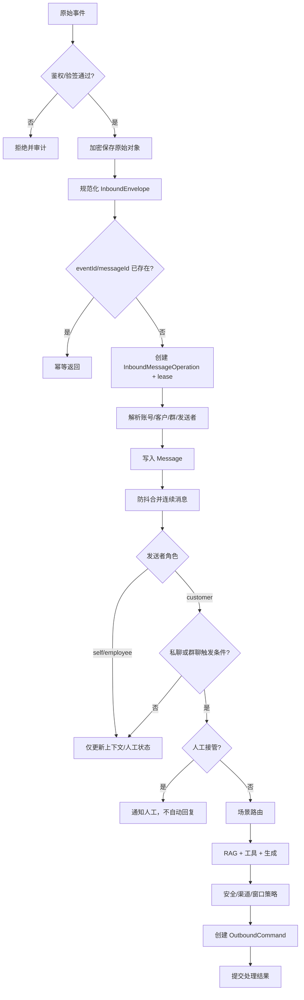

### 6.1 防抖与连续消息合并

3Chat 的“像真人客服”很大一部分来自会话节奏，而不是模型参数。建议：

- 第一条客户消息到达后进入 1.2–2.5 秒可配置防抖窗口；
- 同一 `account + peer + sender` 的后续消息延长窗口，但总等待不超过 6 秒；
- 图片、语音转写与引用消息在窗口内统一组成 `CustomerTurn`；
- 人工接管、投诉、退款、紧急关键词直接打断防抖；
- 群聊按 `group + sender` 聚合，不能把多个客户的问题混成一轮；
- 每个合并轮次生成稳定 `turnId`，重放时不会重复回复。

### 6.2 群聊触发逻辑

```ts
function shouldReplyInGroup(event: InboundEnvelope, config: GroupPolicy): boolean {
  if (event.peer.kind !== "group") return true;
  if (event.sender.role !== "customer") return false;
  if (event.mentions?.some((x) => x.isSelf)) return true;
  if (event.quote?.senderExternalId === config.selfExternalId) return true;
  if (config.replyToAllCustomers && config.allowedCustomerIds.has(event.sender.externalId)) return true;
  return false;
}
```

必须额外维护：

- 群级 `Conversation`；
- 群成员 `ChannelRoomMember`；
- 客户在群内的子会话 `ConversationParticipantState`；
- 机器人/成员自己的渠道身份；
- 单个客户人工接管与整群接管两个层级；
- 同事消息仅进入上下文，不触发回复；
- 引用与 `@` 的被指向对象。

## 7. 人工接管状态机

当前仓库已有 `manualLocked` 和队列阻断，但 3Chat 级别的体验需要显式状态、来源、范围和冷却期。

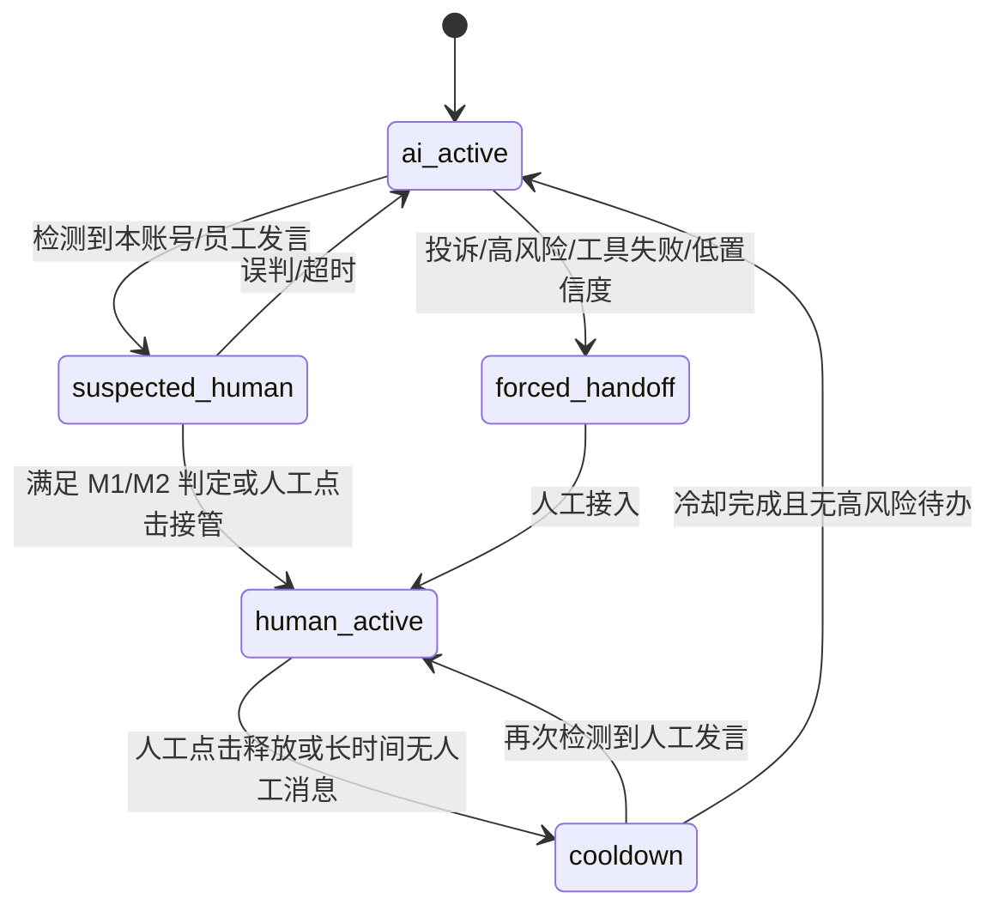

### 7.1 建议数据

```ts
type HandoffScope = "conversation" | "participant" | "account";
type HandoffState = "ai_active" | "suspected_human" | "human_active" | "cooldown" | "forced_handoff";

interface HandoffSnapshot {
  scope: HandoffScope;
  scopeId: string;
  state: HandoffState;
  version: number;
  source: "operator" | "mobile_message" | "policy" | "tool_failure" | "timeout";
  reason: string;
  actorId?: string;
  enteredAt: string;
  releaseAt?: string;
}
```

### 7.2 手机人工发言检测

不能只凭“出现了一条出站消息”就判断人工，因为 AI 自己也会发送。建议同时使用：

- 供应商是否标记消息来源为手机/成员/机器人；
- provider message id 是否能关联到我方 `OutboundCommand`；
- 发送时间是否超过我方最近一次发送的关联窗口；
- 客户是否已经对这条人工消息产生新一轮回复；
- 文本或媒体是否与我方出站 payload 匹配；
- 供应商是否提供 device/source 字段。

任何判断只能在该供应商字段经过真实账号验收后启用。检测到人工后：

1. 原子递增 handoff version；
2. 取消尚未 dispatch 的 AI 任务；
3. 对正在发送的任务标记 `unknown` 并等待回执；
4. 暂停后续自动回复；
5. 收件箱显示接管来源、操作者与时间；
6. 释放时必须记录原因与备注。

## 8. 出站消息与最终送达

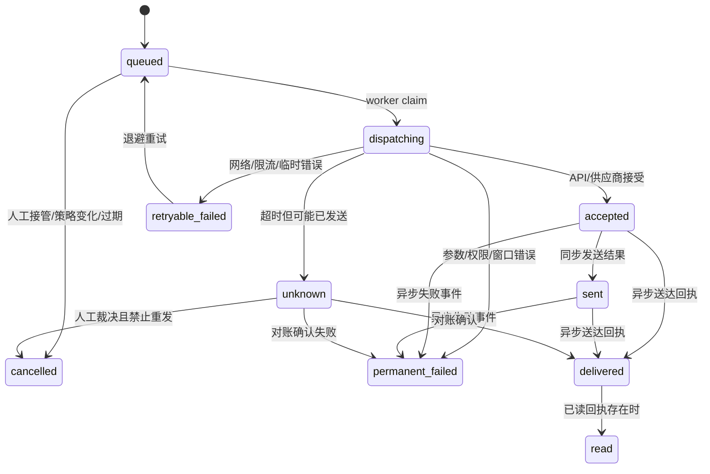

### 8.1 防止重复发送

- 每个业务动作生成稳定 `idempotencyKey`；
- claim 使用 lease + fencing token；
- 网络超时落 `unknown`，不能立即重发；
- 优先调用供应商按 client msgid 查询结果；
- 供应商不支持查询时，只能人工裁决或在明确的安全窗口重试；
- 多段回复每段独立 message id，但共享一个 command group；
- 已成功的前段不能因后段失败全部重发。

### 8.2 自然拆段与节奏

`ResponsePlanner` 接收模型的结构化答案，不让模型直接决定 sleep：

```ts
interface ResponsePlan {
  parts: Array<{
    kind: "text" | "image" | "file";
    text?: string;
    assetId?: string;
    minDelayMs: number;
    maxDelayMs: number;
  }>;
  typingIndicator: boolean;
  stopIfCustomerReplies: boolean;
  expiresAt: string;
}
```

- 按句义拆成 1–3 段，不按固定字数生硬截断；
- 第一段延迟取决于消息长度、渠道与是否需工具；
- 客户在发送间隔中追加消息时，取消未发段并重新合并；
- 群聊避免多段刷屏；
- 企业微信官方 5 条窗口限制要在 plan 阶段完成预算；
- iLink 长任务应先发进度提示，避免上下文失效后静默无回复。

## 9. Agent、知识库和工具架构

## 9.1 当前仓库与目标差距

当前已有：

- `CustomerServiceAgent`、`AgentSkill`；
- `KnowledgeEntry`、`TrainingSample`；
- `RoutingService.evaluate`；
- `RouteEvaluation` 的场景、动作、置信度、风险、知识匹配与回复草稿；
- `AgentSkillExecutorService.execute`；
- `WechatDispatchService` 中的 AI 建议与业务动作编排。

当前未形成完整的向量 RAG：`KnowledgeEntry` 没有 chunk、embedding、检索版本和引用；路由侧更接近关键词/规则匹配。目标不是删除这些能力，而是在其后增加检索服务。

## 9.2 目标 Agent 执行图

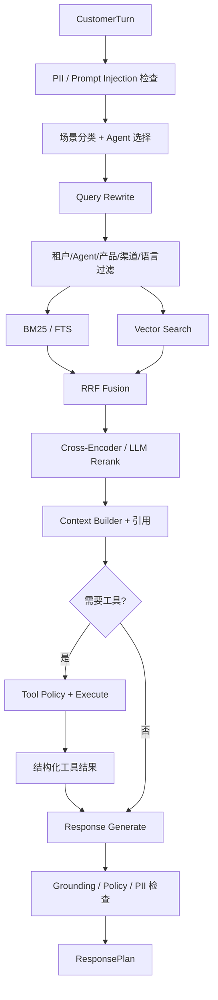

## 9.3 知识入库流水线

1. 上传文件或抓取授权网站；
2. 病毒扫描、MIME 检测、大小限制；
3. 异步解析 PDF、DOCX、XLSX、HTML、Markdown 等；
4. 保留标题、页码、表格、URL 与章节层级；
5. 语义切片，父子 chunk 关联；
6. 计算内容哈希，避免重复向量化；
7. 生成 embedding；
8. 建立 FTS 与向量索引；
9. 发布为新的 `KnowledgeVersion`；
10. 用测试集跑召回率、引用正确率和拒答率；
11. 通过后将草稿版本原子切换为线上版本；
12. 保留旧版本，允许快速回滚。

### 检索建议参数

初始值只能作为测试基线：

- BM25 top 30；
- vector top 30；
- RRF 合并 top 20；
- rerank 后取 5–8 个片段；
- 单文档和单章节设置去重上限；
- 低于场景阈值时不强答，转澄清或人工；
- 每次回答保存 query、候选、分数、选中 chunk、引用和模型版本。

这些参数必须由真实测试集校准，不能直接视为生产最优值。

## 9.4 工具执行

本项目应继续采用 **REST/JSON 作为共享集成层，MCP 作为适配器**：

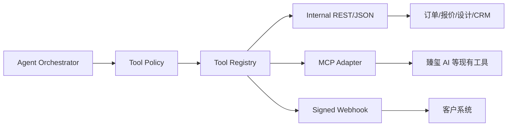

每个工具声明：

- JSON Schema 输入输出；
- 是否只读；
- 是否需要人工审批；
- 幂等 key；
- 最大执行时间；
- 重试语义；
- PII 范围；
- 租户与客户授权范围；
- 审计摘要；
- 失败时的用户话术与转人工策略。

退款、改价、群发、拉群、删除、外部写入等动作必须审批或有明确授权策略。

## 10. Agent Builder 的复刻

3Chat 的 Builder 不只是一个 Prompt 文本框。应实现版本化流水线：

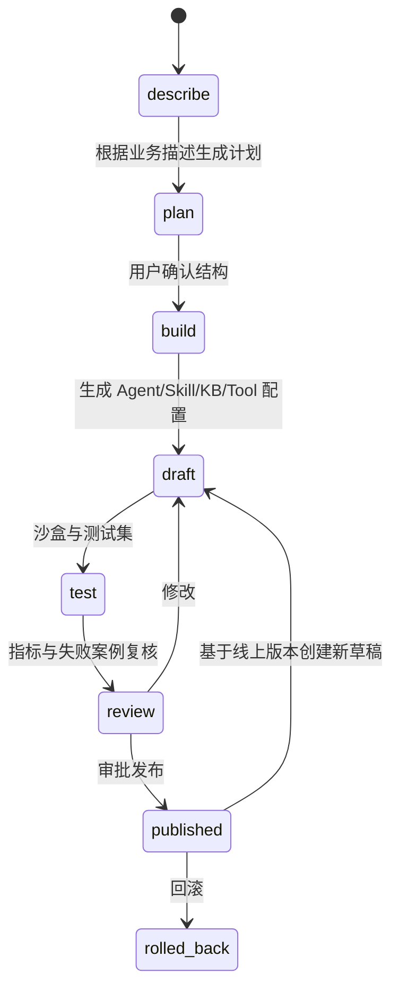

### 版本对象

- `AgentVersion`：系统指令、语言、语气、模型、温度、限制；
- `RoutingPolicyVersion`：场景、优先级、置信度、转人工；
- `SkillVersion`：触发条件、步骤、工具、失败路径；
- `KnowledgeVersion`：文档与 chunk 快照；
- `ChannelPolicyVersion`：各渠道回复、群聊、主动发送策略；
- `EvaluationRun`：测试集、模型版本、结果、成本和延迟；
- `Release`：上述版本的不可变组合。

线上会话必须记录命中的 `releaseId`。否则无法解释“昨天能答、今天为什么变了”。

## 11. 数据模型设计

## 11.1 复用现有表

| 现有模型 | 保留用途 | 需要扩展 |
|---|---|---|
| `WechatAccount` | 账号业务身份 | 逐步迁移到通用 `ChannelAccount` |
| `Customer` | 客户主档 | 增加跨渠道 identity link |
| `Conversation` | 会话主档 | 增加 peer kind、room、handoff version |
| `Message` | 时间线 | 增加 channel message、quote、mention、delivery state |
| `InboundMessageOperation` | 入站幂等与 lease | 增加 tenant/channel/eventId/cursor/rawRef |
| `WechatSendTask` | 出站队列 | 演进为通用 OutboundMessage/Command |
| `WechatSendAttempt` | 尝试和错误 | 增加 provider receipt 与 fencing token |
| `WechatWorkBinding` | 官方客服绑定 | 保留为官方适配器专有映射 |
| `PersonalWechatRpaBinding` | 旧 RPA 兼容 | 不扩成生产个人号协议 |
| `KnowledgeEntry` | 知识条目元数据 | 拆出 document/chunk/version/embedding |
| `RouteEvaluation` | 路由与审计 | 增加 releaseId/retrievalTrace/toolTrace |

## 11.2 新增模型

### 渠道与身份

- `ChannelAccount`
  - `id, tenantId, kind, externalId, displayName, status, capabilities, credentialRef, healthVersion`
  - 唯一键：`tenantId + kind + externalId`
- `ChannelCursor`
  - `accountId, stream, cursor, leaseOwner, fencingToken, leaseExpiresAt`
- `ChannelIdentity`
  - `accountId, externalPeerId, externalSenderId, customerId, role, profileVersion`
- `ChannelRoom`
  - `accountId, externalRoomId, title, ownerExternalId, memberVersion`
- `ChannelRoomMember`
  - `roomId, externalMemberId, customerId, role, displayName, joinedAt, leftAt`
- `ConversationParticipantState`
  - `conversationId, externalParticipantId, handoffState, handoffVersion, lastCustomerTurnAt`

### 可靠消息

- `InboundEvent`
  - 原始事件幂等、签名摘要、rawRef、处理状态；
- `CustomerTurn`
  - 连续消息合并后的业务轮次；
- `OutboundCommand`
  - 渠道无关的发送命令；
- `OutboundPart`
  - 多段文本/媒体及顺序；
- `DeliveryReceipt`
  - 供应商回执、状态、原始码、时间；
- `HandoffEvent`
  - 状态变化、范围、来源、操作者、原因；
- `AccountHealthEvent`
  - online/offline/degraded/risk/expired/credential_error。

### RAG 与版本

- `KnowledgeDocument`
- `KnowledgeDocumentVersion`
- `KnowledgeChunk`
- `KnowledgeEmbedding`
- `RetrievalTrace`
- `AgentVersion`
- `SkillVersion`
- `RoutingPolicyVersion`
- `ChannelPolicyVersion`
- `EvaluationDataset`
- `EvaluationCase`
- `EvaluationRun`
- `Release`

### 营销与任务

- `MarketingTask`
- `MarketingAudienceSnapshot`
- `MarketingApproval`
- `MarketingExecution`
- `MarketingRecipientResult`

营销任务必须保存发布时的人群快照，不能执行时重新计算导致范围漂移。

## 12. 对外与内部 API

## 12.1 渠道入站 API

```http
POST /api/channel-events/v1/{channel}/callbacks/{accountPublicId}
```

要求：

- 供应商专用验签器；
- timestamp + nonce 防重放；
- body hash；
- 请求上限和限流；
- 先入 `InboundEvent` 后快速 2xx；
- 原始密文/明文按安全策略加密保存；
- 禁止回调直接同步调用大模型。

Edge Worker 使用 mTLS 或短期签名 token：

```http
POST /api/edge/v1/events
POST /api/edge/v1/receipts
POST /api/edge/v1/health
GET  /api/edge/v1/commands?accountId=...
POST /api/edge/v1/commands/{id}/claim
POST /api/edge/v1/commands/{id}/complete
```

## 12.2 控制面 API

```http
GET  /api/channels
POST /api/channels/{kind}/accounts
POST /api/channels/accounts/{id}/login-sessions
GET  /api/channels/accounts/{id}/health
POST /api/channels/accounts/{id}/pause

GET  /api/inbox/conversations
GET  /api/inbox/conversations/{id}/timeline
POST /api/inbox/conversations/{id}/handoff
POST /api/inbox/conversations/{id}/release
POST /api/inbox/conversations/{id}/messages

POST /api/knowledge/documents
POST /api/knowledge/documents/{id}/versions
POST /api/knowledge/versions/{id}/publish
POST /api/evaluations/runs

POST /api/agents/{id}/versions
POST /api/releases
POST /api/releases/{id}/publish
POST /api/releases/{id}/rollback
```

这是目标契约草案，不代表当前仓库已存在这些接口；实施时应优先包裹现有 controller/service，避免重复创建等价接口。

## 13. 当前仓库的文件级落地方案

## 13.1 不推翻的部分

- 保留 `desktop/apps/api/src/wechat/wechat-dispatch.service.ts` 作为现阶段业务编排门面；
- 保留 `desktop/apps/api/src/wechat-work/*` 的官方企业微信实现；
- 保留当前 `RoutingService`、`TrainingService`、`AgentSkillExecutorService`；
- 保留 `WechatSendTask` / `WechatSendAttempt`，先适配再迁移；
- 保留 Zhenxi AI 现有 REST/MCP 接口，不重写其业务实现；
- 保留 local store 仅供开发，不将其带入正式多账号生产。

## 13.2 第一批新增文件

```text
desktop/apps/api/src/channels/
  channel.types.ts
  channel.module.ts
  channel-registry.service.ts
  channel-account.service.ts
  channel-capability.service.ts
  inbound-envelope.mapper.ts
  inbound-orchestrator.service.ts
  callback-ingress.controller.ts
  delivery-reconciler.service.ts
  account-health.service.ts
  adapters/
    wecom-kf.adapter.ts
    weixin-ilink.adapter.ts
    hosted-personal-wechat.adapter.ts
    hosted-wecom-member.adapter.ts

desktop/apps/api/src/conversations/
  conversation-coordinator.service.ts
  customer-turn.service.ts
  group-trigger.service.ts
  handoff.service.ts

desktop/apps/api/src/rag/
  rag.module.ts
  ingestion.service.ts
  chunking.service.ts
  embedding.service.ts
  lexical-search.service.ts
  vector-search.service.ts
  fusion.service.ts
  rerank.service.ts
  retrieval.service.ts
  retrieval-evaluation.service.ts

desktop/apps/api/src/agent-runtime/
  agent-orchestrator.service.ts
  release-resolver.service.ts
  tool-registry.service.ts
  tool-policy.service.ts
  response-planner.service.ts

desktop/apps/ilink-edge/
  src/login/
  src/polling/
  src/media/
  src/credentials/
  src/cloud-client/
  src/health/
```

## 13.3 渐进迁移步骤

1. `WechatWorkService` 仍调用原 `processInboundMessage`，但先经过 `InboundEnvelopeMapper`；
2. `InboundOrchestrator` 将统一信封转换为现有 payload；
3. 将 `WechatSendAdapterService` 的 `wechat_work_kf` 分支代理给 `WecomKfAdapter`；
4. 新 iLink 适配器也创建当前 `WechatSendTask`，复用安全队列；
5. 引入通用 `DeliveryReceipt`，回写当前 attempt metadata；
6. 群聊和 handoff 先新增旁表，不立即修改所有旧模型；
7. RAG 先作为 `RoutingService` 的补充数据源，稳定后再替换关键词知识匹配；
8. 完成真实回归后，才把旧 Windows bridge / personal RPA 从产品入口进一步隔离。

## 14. 分阶段复刻路线

## Phase 0：冻结事实与基线

目标：确保不破坏现有企业微信官方链路。

- 固化当前回调、同步、路由、发送、异步失败测试；
- 为 `WechatDispatchService.processInboundMessage` 建立契约测试；
- 记录真实配置缺口，不使用假凭据模拟生产；
- 建立 capability matrix 和供应商待确认清单；
- 现有未提交修改保持隔离，新增迁移逐批提交。

验收：现有测试结果、失败项、未跑项、需要真实账号项分别报告。

## Phase 1：统一消息骨架 + 官方企业微信

目标：先让一条官方渠道跑通新骨架。

- `InboundEnvelope`；
- `ChannelRegistry`；
- `DeliveryReceipt`；
- handoff version；
- 收件箱送达状态；
- 官方微信客服适配器；
- 回调与出站 OpenTelemetry trace。

验收：真实微信客户发消息 -> 入站 -> AI/人工 -> 官方发送 -> 客户手机收到；同时验证异步失败事件。

## Phase 2：完整 RAG 与 Agent 发布

目标：复刻 3Chat 的知识与 Builder 核心体验。

- 文档异步解析；
- chunk、embedding、FTS；
- hybrid + rerank；
- 引用；
- 测试集；
- Agent/Skill/KB/Policy 版本；
- 草稿、发布、回滚；
- 检索与回复评估。

验收：命中率、引用正确率、拒答率、延迟、成本均有基线；不存在知识时不会编造固定模板答案。

## Phase 3：iLink 实验通道

目标：用腾讯公开实现接入微信 Bot。

- 独立 Edge Worker；
- 扫码、凭据、游标、长轮询；
- 文本/图片/文件；
- 上下文 token；
- 多账号隔离；
- 账号健康；
- 非零 ret 失败；
- 实验功能开关。

验收：至少两个测试账号并行隔离；进程重启不丢消息、不重复回复；真实手机双向收发；群聊未实测前保持关闭。

## Phase 4：群聊、自然节奏、移动人工接管

目标：复刻 3Chat v5.x 的会话体验。

- 客户连续消息合并；
- `@`/引用/角色触发；
- 群成员与客户子会话；
- 会话级和参与者级接管；
- M1/M2 类人工检测；
- 回复拆段、取消未发段；
- 工作台清晰展示 AI/人工来源。

验收：同群两个客户并发不串话；同事发言不自动回复；手机人工发言后 AI 停止；释放后按冷却策略恢复。

## Phase 5：采购并接入托管个人微信

前置闸门：合同、API 文档、测试租户、正式回调签名、数据保护评估全部完成。

- 登录与端口状态；
- 账号消息/健康回调；
- 联系人/群映射；
- 文本与媒体；
- 最终回执或对账；
- 朋友圈/群发独立审批域；
- 风控冷却与自动暂停；
- 供应商故障降级。

验收：只用测试账号；连续多日在线；重登与挤线；真实手机收发；不把 API 接受当送达；朋友圈与群发另行验收。

## Phase 6：采购并接入托管企业微信成员号

- Workeasy/Workmate 设备类型；
- 成员、客户、群与权限；
- 手机/PC 人工接管；
- 群发、朋友圈、拉群营销任务；
- 离职与客户继承；
- 多成员账号隔离。

验收：分别按设备类型验证共存/挤线；真实企业管理员授权；客户微信收到；员工在手机/PC 回复后 AI 正确暂停。

## Phase 7：营销与规模化

- 受众快照、审批、频控、黑名单、退订；
- 任务分片、账号容量和错峰；
- 失败收敛、熔断、账号风险评分；
- 多租户配额与成本；
- 灾备、供应商切换和数据导出。

验收：小流量灰度，不以突破平台限制为目标；每个收件人结果可审计；风险升高自动停止。

## 15. 功能复刻矩阵

| 功能 | 官方微信客服 | iLink | 托管个人号 | 托管企微成员号 | 实现位置 |
|---|---|---|---|---|---|
| 私聊自动回复 | 已具备基础 | 可做 | 可做 | 可做 | Core + Adapter |
| 图片/文件 | 图片已具备 | 公开支持 | 依赖上游 | 依赖上游 | Media + Adapter |
| 连续消息合并 | 需补 | 需补 | 需补 | 需补 | CustomerTurnService |
| 手机人工接管 | 产品逻辑不同 | 需实测 | 主要能力 | 主要能力 | HandoffService |
| 群聊 `@`/引用 | 不等同成员群 | 未完全证实 | 版本/上游依赖 | 上游依赖 | GroupTriggerService |
| 每客户子会话 | 需产品定义 | 群聊实测后 | 可做 | 可做 | ParticipantState |
| 主动消息 | 官方窗口限制 | context 限制 | 上游/风控 | 上游/风控 | ChannelPolicy |
| 朋友圈 | 不支持此身份 | 未证实 | 上游依赖 | 上游依赖 | Marketing Domain |
| 群发 | 官方产品限制 | 不应假定 | 上游依赖 | 上游依赖 | Marketing Domain |
| 拉群 | 不等同成员拉群 | 未证实 | 上游依赖 | 上游依赖 | Workflow + Approval |
| 最终回执 | 有异步失败线索 | 需按协议实测 | 必须向上游确认 | 必须向上游确认 | DeliveryReconciler |
| 多账号 | 可做 | 官方插件支持 | 按端口 | 按成员号 | Account Lease |
| 生产推荐 | 是 | 实验/灰度 | 合同后评估 | 合同后评估 | Capability Gate |

## 16. 安全与合规

### 16.1 凭据

- 云端 token 使用 KMS envelope encryption；
- Edge token 使用 Windows DPAPI，绑定运行账号；
- 数据库只保存 `credentialRef`；
- 日志对 token、context token、签名、URL query、身份证号脱敏；
- token 按账号隔离，不能使用“最后一次成功账号”的凭据兜底；
- 轮换后旧 token 有明确失效与回滚流程。

### 16.2 回调

- 严格验签、时间窗、nonce、防重放；
- 回调账号必须与 URL/accountPublicId 一致；
- 签名失败不进入业务队列；
- 原始 payload 使用对象存储 WORM 或保留哈希链；
- 供应商 IP 白名单只作为附加措施，不能替代签名。

### 16.3 媒体与知识

- MIME sniffing，不相信扩展名；
- 文件大小、页数、压缩炸弹和病毒检查；
- 网站抓取防 SSRF，禁止访问内网/元数据 IP；
- 临时媒体有 TTL；
- 每租户对象存储前缀和加密密钥隔离；
- RAG 检索必须先做租户、Agent 和权限过滤，再做向量搜索；
- 外部文档内容视为不可信数据，不能覆盖系统策略。

### 16.4 高风险动作

群发、朋友圈、拉群、退款、删除、改价、外部写入默认需要：

- 明确授权；
- 可见预览；
- 受众/对象快照；
- 审批；
- 频率和额度；
- 幂等；
- 操作后审计；
- 一键停止；
- 供应商/平台规则发生变化时自动降级关闭。

## 17. 可观测性与指标

每条消息使用统一 trace：

```text
provider_event_id
  -> inbound_event_id
  -> customer_turn_id
  -> route_evaluation_id
  -> retrieval_trace_id
  -> tool_execution_id[]
  -> outbound_command_id
  -> send_attempt_id[]
  -> provider_message_id[]
  -> delivery_receipt_id[]
```

核心指标：

- callback 验签失败率；
- 入站重复率、处理积压、lease 超时；
- first response latency、完整回复 latency；
- AI 自动解决率、强制转人工率、人工接管误判率；
- 检索命中率、引用正确率、拒答率；
- 工具成功率、审批率、幂等冲突；
- queued/accepted/delivered/unknown/failed 各状态数量；
- 每渠道账号在线率、重登次数、回调延迟；
- 每账号主动发送量、限流和风险暂停；
- 模型 token、工具与渠道成本。

告警不能只看 HTTP 健康：长轮询进程活着但 cursor 不前进、API 返回成功但没有最终回执、账号在线但连续无入站，都是独立故障。

## 18. 测试与验收标准

## 18.1 合同测试

每个 `ChannelAdapter` 使用相同测试套件：

- 标准文本入站；
- 重复 event/message；
- 乱序事件；
- 媒体与引用；
- 账号隔离；
- 发送成功、临时失败、永久失败、超时未知；
- 回执早于同步返回；
- 人工接管发生在排队后、发送前；
- 进程崩溃后重启；
- token/权限过期；
- 回调签名失败与重放。

## 18.2 群聊测试

- 客户 A `@` 机器人，客户 B 同时发消息；
- 同事发言只进入上下文；
- 引用机器人消息；
- 群昵称重复但 external id 不同；
- 客户 A 人工接管不影响客户 B；
- 整群接管阻止所有自动回复；
- 群成员离开和重新加入；
- 历史消息重放不会再次回复。

## 18.3 RAG 测试

- 有答案、无答案、冲突答案、过期答案；
- 表格、图片 OCR、跨页内容；
- 租户隔离；
- Prompt injection 文档；
- 召回 top-k 与 rerank；
- 引用页码/URL；
- 发布和回滚；
- 同一问题在旧/新 release 的可重复结果。

## 18.4 真实验收分层

| 证据层 | 能证明 | 不能证明 |
|---|---|---|
| 单元/合同测试 | 状态机、映射、幂等 | 真实平台行为 |
| 沙盒/Mock | 错误分支和回调 | 真实 token、风控、送达 |
| API 测试账号 | 平台接受、基本收发 | 长期在线和客户手机稳定性 |
| 真实手机/成员端 | 用户可见收发与接管 | 规模群发安全 |
| 多日灰度 | 稳定性、重登、回执 | 大规模长期 SLA |
| 正式生产 | 实际业务结果 | 未覆盖渠道或未测功能 |

任何阶段都不能把上一层证据包装成下一层结论。

## 19. 供应商接入前必须拿到的答案

1. API 基础 URL、版本策略、变更通知；
2. 鉴权、签名、token 轮换；
3. 登录与二维码状态码；
4. 账号、联系人、群、成员的稳定唯一 ID；
5. 入站回调的事件唯一键和乱序语义；
6. 消息类型与原始媒体有效期；
7. client msgid/idempotency key；
8. 同步接受、实际发送、最终送达、失败回执定义；
9. 是否支持主动查询发送结果；
10. 限流、并发、窗口和重试；
11. 手机/PC/Pad 共存与挤线规则；
12. 人工发言来源字段；
13. 朋友圈、群发、拉群能力及审核；
14. 账号离线、风险、过期和余额不足事件；
15. 数据留存、删除、导出和地域；
16. 人脸/实名信息是否经过我方系统；
17. 测试租户、测试账号和回放工具；
18. SLA、故障通知、赔偿和退出迁移；
19. 是否允许我方缓存联系人、消息与媒体；
20. 是否有正式安全审计和合规文件。

任一关键答案缺失，对应能力保持 `blocked`，不能通过猜字段开始生产开发。

## 20. 最终推荐技术方案

### 近期

以现有企业微信官方微信客服为唯一生产通道，先完成统一渠道骨架、最终回执、人机接管、完整 RAG 与 Agent 版本发布。这部分无需等待任何私人托管供应商，且能直接提升当前产品。

### 中期

新增独立 iLink Edge，作为微信 Bot 灰度能力。它使用腾讯公开实现，开发确定性最高，但产品上必须标明它与个人微信云端托管不是同一能力。

### 后期

在合同和测试环境齐备后接入托管个人微信与托管企业微信成员号。我们的核心资产应是统一会话、Agent、RAG、工具、工作台和可靠消息层；供应商只负责设备与渠道连接。这样即使供应商变化，业务核心也无需重写。

### 对“完美复刻”的定义

可以承诺的“完美复刻”是：

- 用户可见功能一致；
- 状态机与业务行为可重复；
- 多账号、群聊和人工接管不串话；
- 知识回答有依据，工具动作可审计；
- 每条消息能追到最终结果或明确标记未知；
- 通道可替换；
- 未验证能力保持关闭。

不能承诺的是：复制微信私有协议、伪造客户端设备、绕过平台风控或保证任何个人号永不下线。即使取得第三方供应商 API 使用权，也不等于取得腾讯官方授权。

## 21. 主要公开依据

- [腾讯 openclaw-weixin：iLink 插件、登录和协议说明](https://github.com/Tencent/openclaw-weixin)
- [3Chat：个人微信接入教程，2026-04](https://group.3chatai.cn/t/topic/292)
- [3Chat：企业微信托管 Workeasy / Workmate](https://group.3chatai.cn/t/topic/64)
- [3Chat：接入渠道前的消息与账号回调配置](https://group.3chatai.cn/t/topic/147)
- [3Chat：企业微信官方微信客服配置](https://group.3chatai.cn/t/topic/75)
- [3Chat：知识库功能说明](https://group.3chatai.cn/t/topic/87)
- [3Chat：AI 技能功能说明](https://group.3chatai.cn/t/topic/82)
- [企业微信官方：读取微信客服消息](https://open.work.weixin.qq.com/api/doc/90000/90135/94670)
- [企业微信官方：发送微信客服消息](https://open.work.weixin.qq.com/api/doc/90000/90135/94677)

本蓝图中的私有托管适配器路径、数据库表和内部 API 是基于已确认产品行为给出的工程设计，并不代表 3Chat 或其供应商公开了相同内部代码。真正接入时以签约后的正式接口契约为准。
