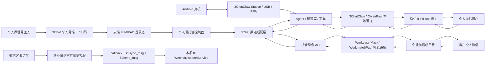
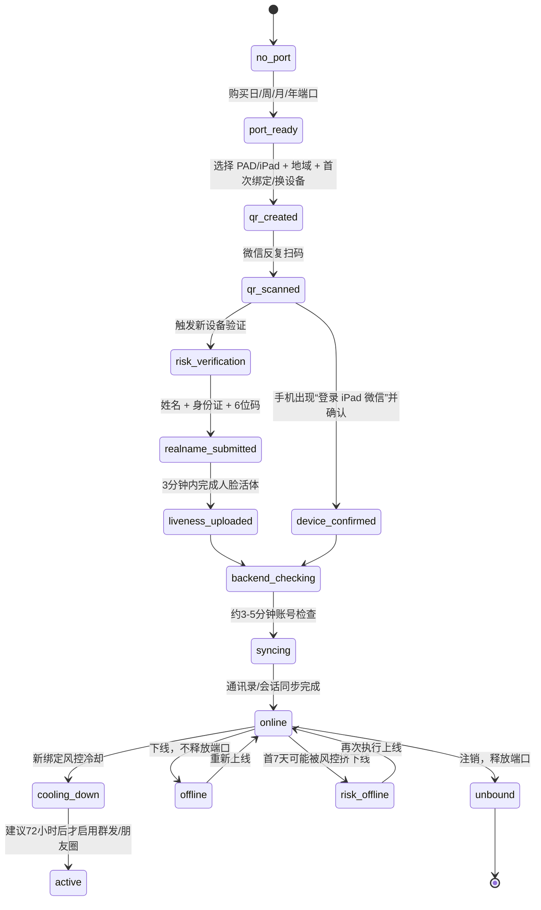
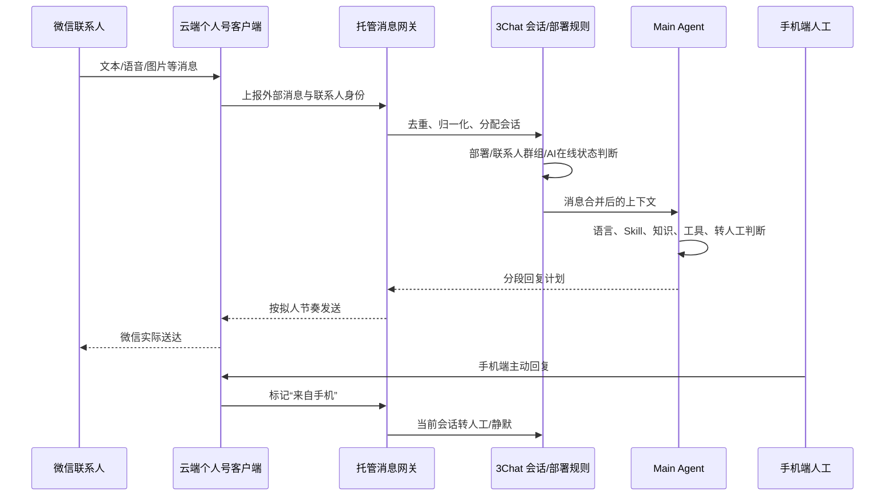
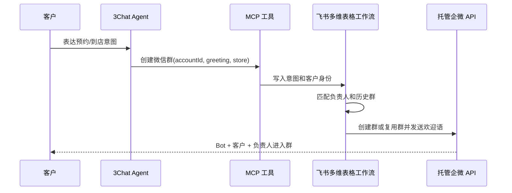
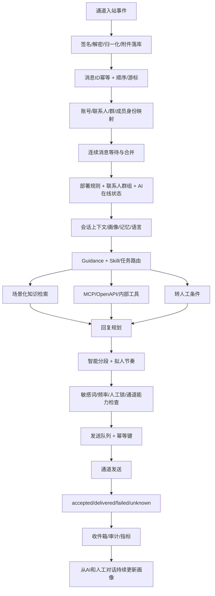
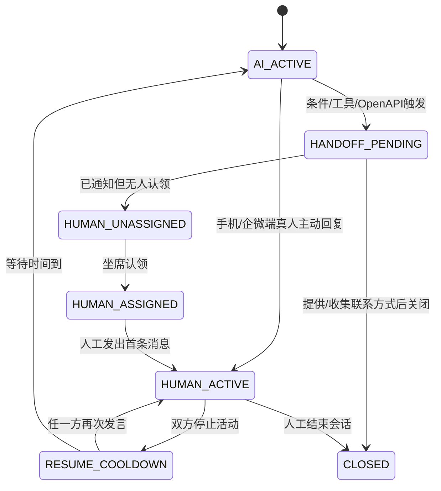

# 3Chat 微信 / 企业微信通道技术拆解与可落地复刻方案

> 调研日期：2026-08-13<br>
> 结论口径：只把公开文档、公开源码、可复现构建或本仓库现状作为事实；宣传页、配置项和推断不能替代真实账号收发验收。

## 0. 授权口径更正

本报告不把 3Chat 的“个人微信托管”和“企业微信成员号托管”称为腾讯官方授权接口。按用户补充的事实和公开技术形态：

- 个人微信走云端 PAD/iPad 客户端登录态托管，不是微信开放平台个人号消息 API；
- 企业微信成员号走 Workeasy/Workmate 类 Mac/iPad 客户端登录态托管，不是企业微信官方成员消息 API；
- 账号本人扫码、实名或同意登录，只是账号登录动作，不等于服务商取得腾讯官方接口授权；
- 第三方聚合平台向 3Chat 提供 API，只代表两家公司之间存在技术接入，不代表腾讯认可该私有客户端通道；
- 企业微信官方“微信客服”第三方应用授权是另一条独立链路，不能拿它为个人号或成员号托管背书；
- 腾讯公开的 iLink 插件也必须与主站个人号云端托管分开判断。

公开证据足以判断这些产品采用的技术形态，但不足以证明一家公司的全部未公开商务关系。因此最准确结论是：**公开材料中未发现个人号/企微成员号托管获得腾讯官方授权的证据，其实现形态也不是对应官方消息 API。**

## 1. 最终结论

3Chat 展示的“微信能力”至少由五套不同系统拼成，不应混为一个接口：

1. **3Chat.ai 托管个人微信**：把个人微信登录为云端 iPad/PAD 设备，需要端口、扫码、设备地区、新设备实名/人脸辅助和后台同步。朋友圈、群发、手机人工接管等主站能力来自这条链路，不是 iLink。
2. **3ChatClaw 微信频道**：高度确定是腾讯微信 iLink Bot HTTP 协议，界面和配置高度复用了 QwenPaw 的微信通道实现。它不是读取微信本地数据库，也不是主站的云端 iPad 托管个人号。
3. **3ChatClaw 真机 RPA**：官网还宣传本地 Station 通过 USB 接管 Android 真机，执行抖音、小红书、视频号等 App 内点击、滑动和私信操作。这是另一套本地设备自动化，与 iLink 微信频道分开。
4. **3Chat.ai 托管企业微信成员号**：不是企业微信官方“微信客服”接口，而是通过 Workeasy / Workmate 等云端设备形态托管真实企业微信成员账号，再由聚合服务提供消息、联系人、客户群、营销任务和回调 API。
5. **企业微信官方微信客服**：以 `callback -> kf/sync_msg -> kf/send_msg` 工作，是本项目当前已经实现、可作为生产默认路线的官方接口，但产品身份是客服账号，不是成员个人号。

可以高可信复刻的是**用户可见行为、Agent 状态机、通道抽象、数据模型、消息管线、工作台和可靠性机制**。不能在没有供应商合同、正式 API 文档和凭证时声称已经复刻云端个人号或 Workeasy / Workmate 的私有客户端协议；不能把个人号群聊、朋友圈和突破群发限制包装成已经安全验收的能力。

## 2. 证据等级

| 等级 | 含义 | 本次证据 |
|---|---|---|
| A | 官方源码或官方接口文档 | Tencent/openclaw-weixin、企业微信官方微信客服接口 |
| B | 3Chat 官方教程、产品页面或社区人员说明 | 主站个人号接入、3ChatClaw 微信、企微托管、版本公告、掉线与拉群方案 |
| C | 可公开访问的同生态 API 文档或公开客户端静态证据 | 托管账号/消息/联系人/群聊 Apifox 文档、公开人脸辅助 APK |
| D | 基于字段、路径和产品行为的推断 | 3ChatClaw 包装 QwenPaw、主站个人号的托管供应商内部连接方式 |
| E | 必须真实账号验证 | 个人号/企微真实登录、群聊、朋友圈、群发、长期在线和手机端最终送达 |

本方案只允许 A/B/C 级证据直接进入接口契约；D 级只能进入“待验证假设”；E 级没有真实结果前必须标记 `blocked`。

## 3. 产品层拆解



3ChatClaw 官网还宣传“本地 Station + Android 真机 + USB/RPA”来操作抖音、小红书、1688、拼多多等没有开放接口的平台。这套真机 RPA 与微信 iLink 通道不是一回事。当前官网前端包中可直接枚举到的演示视频资源为：

- `https://claw.3chatai.com/videos/hero-3.webm`
- 2026-08-13 HEAD 验证：HTTP 200、`video/webm`、61,210,817 bytes、Last-Modified 2026-05-17。

## 4. 3Chat.ai 托管个人微信：主站个人号的真实实现

这条链路是用户所说“直接用个人微信号做客服”的核心。3Chat 官方把它称为“托管个人号”，公开操作和客户端静态证据都指向一个**云端 iPad/PAD 客户端登录态 + 3Chat Agent 控制面**，而不是微信开放平台、公众号接口或 iLink。

### 4.1 账号接入状态机

公开教程可还原出以下状态：



已公开的操作约束：

- 3Chat 空间必须用手机号注册；邮件或用户名空间不能初始化个人号环境；
- 用户需要一台 Android 手机安装“人脸验证助手”；所谓 `wxrl_ios.apk` 仍是 Android APK，不是 iOS 应用；
- 接入页区分“首次绑定”和“换设备”，3Chat 明确警告频繁换设备有风险；
- 登录方法只能是扫码，选择与账号当前所在地一致的地域以降低首次设备验证概率；
- 公开价格为日 30、周 200、月 800、年 7200；试用账号赠送 450 币，可购买 15 天；
- 扫码可能需要多次返回重扫，直到微信显示“登录 iPad 微信”；
- 新设备验证需姓名、身份证号、3Chat 页面六位码和人脸活体，整个流程要求 3 分钟内完成；
- 验证后 3Chat 后台还需约 3-5 分钟检查；另有工单说明刚接入的前三分钟消息可能不收不回；
- “下线”停止收发但不释放端口，“注销”释放端口；
- 首次绑定后 7 天内可能因微信风控掉线一次；3Chat 建议保持在线 72 小时后再做群发或朋友圈，并承认提前操作有明显封号风险。

这不是一个无状态扫码 API，而是“租用设备位 + 维持客户端会话 + 风控恢复 + 消息同步”的长期资源模型。

### 4.2 人脸辅助 APK 静态审计

本次只做了下载、哈希、Manifest、签名、DEX 字符串引用和资源静态分析，**没有安装或运行 APK，也没有向实名/人脸提交接口上传任何数据**。

| 文件 | 大小 | SHA-256 | 包名 / 版本 |
|---|---:|---|---|
| `wxrl.apk` | 19,792,868 | `DC8C2C278E27E1B29A3F28BCE91928C4BB94687064E63814BF8028C4E5F2692F` | `com.tencent.mx` / 1.1.0 |
| `wxrl_ios.apk` | 39,301,096 | `7F8E1884D54BDC8CA643079A451F42D45087E3368EF784152F8D3DC832F59F1B` | `com.tencent.mix` / 1.1.1 |

两个 APK 的共同事实：

- 下载链接是明文 HTTP 且不在应用商店；包名带 `com.tencent` 不能证明它是腾讯官方发布；
- 两者使用同一张通用 Android 调试证书签名，证书主题和签发者均为 `CN=android`，不是可验证的企业发布证书；
- `targetSdkVersion=28`、`allowBackup=true`，申请网络、相机、外部存储、修改设置、管理外部存储和人脸识别相关权限；
- 包含腾讯优图活体/人脸跟踪库、微信 xlog、OpenCV、阿里云 OSS 客户端等原生库；
- 存在 `sub-real(name, card, sdcs, ver)`、`get-face`、`get-ver`、`sub-face(faceDataUrl, ...)` 和日志上报接口；
- 活体素材会先上传到阿里云 OSS，再把素材 URL 提交给人脸验证服务；DEX 中还存在明文 HTTP、明文 WebSocket、远端调试/配置服务；
- APK 内嵌了静态 OSS 访问凭证。报告不复述凭证值，但这本身是严重的供应链和数据安全问题；
- `YtSDKSettings.json` 要求 `best_image`、活体、张嘴/睁眼检测，并把资源目录伪装为微信人脸目录；`bioconfig.txt` 包含 WeChat/Youtu 生物识别配置。

因此能确认的不是“3Chat 自己保存了人脸”，而是：**人脸/活体数据至少会离开 Android 设备，经过 OSS 和远端验证服务处理**。3Chat 教程的“不收集、不存储、不保留”只能理解为其对自身业务留存的声明，不能替代供应商处理协议、保留期限、删除机制、加密说明和独立安全审计。复刻时不应照搬该 APK、包名、接口或凭证。

### 4.3 消息接待与手机人工接管

个人号上线后的主消息流可以还原为：



3Chat v5.0 公布了“来自手机”消息的判定补丁。原因是渠道自动欢迎语和真人手工消息都会被托管客户端标成同一来源：

1. 收到手机侧消息 `M1` 后，Agent 进入静默窗口；
2. 若随后出现 `M2`，且 `M2-M1 > 1 秒`，判为真人连续输入并触发人工接管；
3. 若客户先发消息，随后出现手机侧 `M2` 完成一个对话回合，也判为人工接管；
4. 静默窗口可在 Agent 基础设置的聊天会话分类中配置；
5. v5.1 进一步把“手机端人工回复即触发转人工”作为个人微信正式能力公布。

正确复刻不能只靠一个 `human=true`：至少需要 `AI_ACTIVE -> HUMAN_SUSPECTED -> HUMAN_ACTIVE -> COOLDOWN -> AI_ACTIVE`，并记录触发消息、静默截止时间、最后双方活动时间和恢复计时。任一方在恢复等待期内继续发言都要重置计时。

### 4.4 个人号功能边界与版本冲突

| 功能 | 公开证据 | 当前结论 |
|---|---|---|
| 私聊文本接待 | v5.0 官方公告、接入教程和工单 | 已有产品能力；未在本环境真实账号验收 |
| 多个人号统一管理 | v5.0 公告 | 产品能力；供应商端口和账号隔离需实测 |
| 语音读取 | v5.1 公告 | 已公布；ASR 供应商、时延和方言效果未公开 |
| 手机端人工接管 | v5.1 公告 + v5.0 时序修复 | 逻辑已公开，需真实双端并发验收 |
| 朋友圈/群发 | 社区真实工单出现敏感词拦截 | 至少存在功能入口；高风控，不等于安全稳定 |
| 微信群自动回复 | 4 月接入教程写 Beta 不支持；6 月 v5.1 仍写预计 v5.4；个别用户称曾收到群回复 | 版本/灰度冲突，必须标记 `blocked` |
| 回复“企业微信联系人” | 4 月教程写 Beta 不支持 | 未见后续正式解除说明，`blocked` |
| 联系人、会话在收件箱展示 | v5.1 Channel View 支持个人微信；有刚接入不显示的工单 | 已有产品能力，但同步有延迟和历史缺陷 |

对于群聊，正式版本公告的证据权重高于单个用户体验：v5.1 明确说先支持企业微信群，个人微信群预计 v5.4。即使某租户或灰度分支曾能自动回复，也不能推导出成员识别、@、引用、收件箱分组、人工接管和稳定送达都完整可用。

### 4.5 托管个人号的最小数据模型

```ts
type PersonalWechatAccountState =
  | "no_port" | "port_ready" | "qr_pending" | "risk_verification"
  | "backend_checking" | "syncing" | "online" | "cooling_down"
  | "offline" | "risk_offline" | "restricted" | "unbound";

interface HostedPersonalWechatAccount {
  tenantId: string;
  providerPortId: string;
  providerAccountId?: string;
  loginFlavor: "pad" | "ipad";
  region: string;
  state: PersonalWechatAccountState;
  boundAt?: string;
  coolingDownUntil?: string;
  lastInboundAt?: string;
  lastProviderHeartbeatAt?: string;
  riskReason?: string;
}

interface HumanTakeoverState {
  conversationId: string;
  mode: "ai" | "suspected_human" | "human" | "cooldown";
  triggerMessageId?: string;
  silentWindowUntil?: string;
  resumeAt?: string;
  lastCustomerAt?: string;
  lastSelfAt?: string;
}
```

这套 provider 在没有正式合同、测试租户、回调签名和数据处理协议前，只能定义抽象接口，不能用 APK 中的私有端点直接做生产集成。

## 5. 个人微信：iLink 的真实实现

### 5.1 为什么能确定 3ChatClaw 使用 iLink / QwenPaw

3Chat 教程公开了以下细节：

- 扫码后自动得到 `Bot Token`；
- 默认 Token 文件为 `~/.qwenpaw/wechat_bot_token`；
- 媒体目录、私聊策略、群聊策略、白名单、@ 提及、消息合并；
- 本地 3ChatClaw 和 Agent 必须持续在线。

这些字段、默认路径和描述与 QwenPaw 的 `channels.wechat` 配置逐项一致。QwenPaw 源码默认文件、类名、HTTP 客户端和消息合并逻辑也完全对应，因此“3ChatClaw 在 QwenPaw 微信通道之上做产品包装”是强推断；但没有 3Chat 私有源码，不能声称逐行相同。

### 5.2 登录与凭证

腾讯插件审计版本：

- 仓库：`Tencent/openclaw-weixin`
- commit：`cef0bfc390393f716903e16d50408118047f87e0`
- package：`@tencent-weixin/openclaw-weixin@2.4.6`
- license：MIT

登录流程：

1. 请求 `get_bot_qrcode?bot_type=3` 获取二维码。
2. 最长约 5 分钟轮询二维码状态。
3. 支持 waiting、scanned、confirmed、expired、验证码、重定向和已绑定重定向等状态。
4. confirmed 返回 `bot_token`、`ilink_bot_id/accountId`、`baseurl`、`userId`。
5. 每个微信账号独立保存凭证、同步游标和上下文令牌；多账号不能共用默认会话桶。
6. 腾讯实现会把凭证文件权限收紧为 0600；Windows 下还应补充 DPAPI 或应用级密钥加密。

通用请求头：

```http
Content-Type: application/json
AuthorizationType: ilink_bot_token
Authorization: Bearer <bot_token>
X-WECHAT-UIN: <random_uint32_as_base64>
iLink-App-Id: <app id>
iLink-App-ClientVersion: <client version>
```

### 5.3 入站、游标与恢复

核心接口为 `POST ilink/bot/getupdates`：

```json
{
  "get_updates_buf": "<last cursor>",
  "base_info": { "channel_version": "<version>" }
}
```

服务端最长保持约 35 秒，响应包含 `msgs`、新 `get_updates_buf` 和建议轮询超时。可靠实现必须：

- 在处理完一批消息后持久化每个账号自己的游标；
- 以消息 ID / context token 去重；
- 三次连续失败后进入更长退避；
- `errcode=-14` 视为会话过期，暂停请求并要求重新授权；
- 账号维度隔离 cursor、credential、peer context 和 session；
- 重启后从最后已提交游标恢复，不能每次从空游标开始。

腾讯插件已经持久化 `get_updates_buf`。本次审计的 QwenPaw 版本只把 `_cursor` 保存在进程内存，因此直接照搬 QwenPaw 会有重启后的重复或漏处理风险。

### 5.4 上下文令牌与发送限制

`sendmessage` 不是一个任意联系人主动群发接口。发送请求需要带入站消息提供的 `context_token`：

```json
{
  "msg": {
    "to_user_id": "<peer@im.wechat>",
    "client_id": "<uuid>",
    "message_type": 2,
    "message_state": 2,
    "context_token": "<token from inbound>",
    "item_list": [
      { "type": 1, "text_item": { "text": "你好" } }
    ]
  }
}
```

QwenPaw 代码把 `ret=-2` 解释为 context token 已无效或已消费，并中止同一请求后续发送。它的“消息合并”注释明确是为了缓解 context token 的消息条数限制。因此复刻时必须：

- 将 context token 绑定到 `accountId + peerId`，不能跨人复用；
- 每次入站原子更新最新 token；
- 出站将多个文本片段先合并，避免无意义拆成多条；
- API 明确拒绝时记为 `failed`，网络结果未知时记为 `unknown`，禁止盲目重发；
- 不承诺无限制主动触达或营销群发。

### 5.5 媒体

腾讯公开实现支持：

- 入站：文本、图片、语音、文件、视频；语音可读取平台 ASR 文本；
- 出站：文本、图片、文件、视频；不应承诺语音文件原生发送；
- CDN：`novac2c.cdn.weixin.qq.com/c2c`；
- 文件：先生成 AES key，AES-128-ECB + PKCS#7 加密，计算明文 MD5/大小和密文大小；
- `getuploadurl` 获取预签名上传参数；上传密文后，把 CDN 引用放入 `sendmessage`。

QwenPaw 的网页文档一处仍写“只支持发送文本”，但同一页面的能力矩阵和当前源码已经支持图片、文件、视频。这属于文档不同步，最终应以具体版本源码和真实账号测试为准。

### 5.6 群聊：当前不能作为已完成能力

这是本次调研最重要的纠错：

- 3Chat 教程明确宣传“好友或微信群”、群策略和 @ 提及；
- QwenPaw 解析代码预留了 `group_id` 和群 session ID；
- 但同一 QwenPaw 源码明确注释：`WeChat iLink Bot is single-chat only (no group chat)`；
- 腾讯插件当前把 `ChatType` 固定为 direct、`isGroup` 固定为 false。

因此，配置界面出现“群聊策略”不等于底层已经能收到微信群事件。可能性包括：未来预留、特定灰度账号、3Chat 私有分支或宣传超前。没有以下真实证据前，微信群状态必须是 `blocked`：

1. 测试账号真实进入微信群；
2. `getupdates` 返回真实 `group_id`；
3. 群成员身份、@ 提及和引用消息正确解析；
4. 回复落到同一群而不是误发私聊；
5. 重启、重复回调和多群并发不串会话。

## 6. 企业微信成员号：3Chat 托管层

### 6.1 托管方式

3Chat 官方教程给出两种生产形态：

| 方案 | 设备身份 | 共存限制 | 首次登录 |
|---|---|---|---|
| Workeasy | Mac 企业微信客户端 | 不能与企微 PC 客户端同时在线，否则互相挤下线 | 扫码 |
| Workmate | iPad 企业微信客户端 | 可与 PC 同时在线，不能与真实 iPad 端同时在线 | 可能触发手机实名验证 |

这说明它不是浏览器自动化，也不是企业微信官方客服账号，而是云端模拟/托管一个真实客户端登录态。3Chat 还要求用户在上游“API 事件配置”中填写：

```text
聊天消息回调：https://app.3chatai.cn/api/ai/integration/chatly/callback/message
账号事件回调：https://app.3chatai.cn/api/ai/integration/chatly/callback/account
```

3Chat Webhook 事件列表中出现“句子托管账号掉线”，进一步证明 3Chat 把托管上游事件转换为自己的开放平台事件。

### 6.2 可交叉验证的公开托管 API

同生态公开 Apifox 文档暴露了完整接口目录。它与 3Chat 的 Workeasy/Workmate、账号回调、聊天回调和“句子托管”事件高度吻合，但公开页面没有明确写出 3Chat 的供应商合同或生产 base URL，因此只能作为 C 级接口证据，不能直接拿路径猜生产服务。

账号控制：

```text
POST /api/v2/bot/create
POST /api/v2/bot/delete
POST /api/v2/bot/restart
GET  /api/v2/bot/query
POST /api/v2/bot/code
```

创建账号的公开结构：

```json
{
  "groupId": "<tenant group>",
  "tokenRegion": "BEIJING",
  "tokenType": "WORKPRO"
}
```

公开枚举包含 `WORKPRO / WORKEASY / WORKMATE / WORKZEN`。创建后返回 `botId`；query 返回 `status / loginStatus / botUrl / syncing`，其中 `botUrl` 用于二维码/登录流程，验证码由 `/bot/code` 提交。

消息发送：

```text
POST /api/v2/message/send?token=<org_token>
```

3Chat 的“发送微信卡片”官方教程把实际调用地址公开为：

```text
https://ae-bg.ddregion.com/hub-api/api/v2/message/send?token=<企业级Token>
```

因此 `ddregion.com/hub-api` 已不是单纯相似文档推断，而是 3Chat 教程实际使用的托管消息网关。仍然不能据此推断所有账号、联系人、群和营销接口都对每个 3Chat 租户开放。

```json
{
  "externalRequestId": "<idempotency key>",
  "imBotId": "<hosted account id>",
  "imContactId": "<private peer id>",
  "imRoomId": "<room id; private or room choose one>",
  "messageType": 7,
  "payload": { "text": "你好" }
}
```

公开文档说明 `imContactId` 与 `imRoomId` 至少存在一个；同时存在时优先私聊对象。接口返回 `requestId`，最终结果通过回调给出 `externalRequestId / requestId / messageId / sendCode / errorCode`。因此正确实现必须采用“提交已受理”和“最终送达结果”两阶段状态，不能在 HTTP 200 时直接显示已送达。

消息入站回调公开字段包括：

```text
orgId, token, botId, imBotId, botUserId, chatId,
imContactId, imRoomId, roomWecomChatId, roomTopic,
messageId, isSelf, sendBy, source, externalUserId,
contactName, contactType, messageType, payload
```

账号回调包含 `eventType / logoutReason / bot.status / imBotId / wecomUserId / group`。另有账号限制和消息限制回调，消息限制示例直接返回“因账号违规，当前功能已被限制使用”。这说明 3Chat 类产品必须有账号健康状态机，不能只做一个“已连接”布尔值。

### 6.3 联系人和客户群

公开接口目录还包含：

- 联系人列表、客户详情、externalUserId 与内部 wxid 互转；
- 群列表、群详情、群二维码、创建群、加/移成员、改名、转移群主、解散群；
- 企业微信 chatid 与系统 roomwxid 互转；
- 通过手机号加好友、好友申请/通过回调；
- 群聊加入、退出、改名事件；
- 群发、朋友圈、欢迎语、标签和防骚扰策略。

3Chat 的公开拉群方案不是 Agent 直接调用企业微信客户端，而是：



它需要企业级 Token、小组级 Token、企业通讯录同步、联系人创建/更新事件和群创建接口。也就是说，“智能拉群”是**身份同步 + 工作流 + 托管群 API**的组合，不是一个大模型提示词功能。

### 6.4 不能直接复刻的部分

以下内容没有公开、不能猜：

- Workeasy / Workmate 客户端协议、设备指纹和风控实现；
- 3Chat 与句子托管服务的正式生产 base URL、签名方式、租户开通和计费合同；
- 账号类型枚举在各租户的真实可用范围；
- 私有回调重试策略和消息类型完整 payload；
- “稳定不封号”承诺。

可落地做法是定义 `HostedWecomProvider` 适配器，并只在拿到正式供应商文档、测试租户和密钥后实现具体 provider。不要在代码里硬编码本报告中的公开示例路径去探测第三方生产系统。

## 7. 企业微信官方能力与托管成员号的区别

| 维度 | 官方微信客服 | Workeasy / Workmate 托管成员号 | 主站托管个人微信 | 3ChatClaw iLink |
|---|---|---|---|---|
| 身份 | `open_kfid` 客服账号 | 真实企微成员号 | 真实个人微信的 iPad/PAD 登录态 | 微信 ClawBot/iLink 授权账号 |
| 入站 | 回调通知后 `kf/sync_msg` | 第三方托管回调 | 个人号托管网关回调 | `getupdates` 长轮询 |
| 出站 | `kf/send_msg` | 托管服务 `message/send` | 托管客户端发送 | `sendmessage` + context token |
| 私聊客户 | 支持 | 支持 | 已公布支持 | 当前公开实现支持私聊 |
| 客户群管理 | 不等同成员号客户群 | 托管服务可管理客户群 | v5.1 明确尚未正式支持 | 当前公开实现未证明微信群 |
| 主动营销 | 受官方规则约束 | 上游有群发/朋友圈/素材接口 | 有群发/朋友圈入口但高风控 | context token 限制，不是群发接口 |
| 合规与账号风险 | 官方路径，风险最低 | 依赖供应商、客户端策略和企业合同 | 非官方个人号客户端托管，风险最高 | 腾讯官方插件，但仍有限灰度 |
| 生产建议 | 默认 | 仅合同和真实验收后可选 | 不作为生产默认通道 | 实验/低风险场景 |

2026 年企业微信还公开展示了 OpenClaw 插件和“以用户个人身份”读写文档、日程、会议、待办、通讯录、发起单聊/群聊等能力。现有公开材料指向企业内部办公助手，不能据此推断它能替代成员号与外部客户微信自动沟通。

## 8. Agent、群聊、人工接管和运营功能的完整逻辑

通道只解决“消息怎么进来、怎么发出去”。3Chat 真正的产品壁垒是中间这套确定性编排：



### 8.1 连续消息与回复节奏

3Chat 基础设置公开了三种连续输入策略：逐条回复、按 Agent 思考时间动态等待、自定义秒数等待。复刻时应为每个 `tenant + channel + account + peer/room` 建立 debounce bucket：

1. 新入站消息进入 bucket 并刷新截止时间；
2. 截止前的新消息与旧消息按时间顺序合并；
3. AI 推理开始后到来的消息要么取消旧推理重新生成，要么排到下一轮，不能并发生成两个互相矛盾的回复；
4. 生成结果按语义段切分，短句延迟短、长句延迟长；
5. 任一发送失败都要保留整个 reply plan，避免重试时只补一半或重复全部消息。

### 8.2 部署、联系人群组与 Skill 路由

- 联系人群组可按标签、来源渠道、语言、自定义字段等条件筛选；一个 Skill 可限制只对匹配群组生效；
- v5.3 的群聊部署还支持群标准字段、群自定义字段、群成员和会话字段；
- Main Agent 先判定服务语言，再根据当前对话确定一次会话的稳定语言；URL、邮箱、图片等不应导致语言误切换；
- Builder 的核心不是一个总提示词，而是 `Describe -> Plan -> Build -> Test/Evaluate -> Review -> Publish`，并分别版本化 Builder、Guidance 和 Skills；历史版本恢复先生成草稿，不直接覆盖线上版本；
- 知识库处理是异步任务：接收文件/URL/文本、解析、切片、向量化、入库、用量统计、任务进度/Webhook。v5.3 又增加“知识适用情景”和 Skill 限定知识范围；
- 当前仓库静态搜索未发现 embedding、pgvector、Qdrant、Milvus、Weaviate 或 rerank 实现，现有回复草案主要是关键词抽取/计分，不能把它称为已经复刻 3Chat 的完整 RAG。

### 8.3 转人工状态机



关键规则：

- “AI 回复一句正在转人工”不等于已经转人工，必须成功执行工具/API 并进入明确状态；社区已有多起只回复文案但没有实际转接的失败案例；
- 支持直接转人工、提供联系方式后关闭、收集手机号/邮箱后关闭三种行为；
- 转人工可邮件/短信通知，也可通过 Webhook 进入飞书、企微、CRM；公开 API `POST /api/open/v3/butler/transferToHuman` 以 `dialogId` 触发；
- v5.0 已支持 API 指定具体人工坐席，可按客户等级、地区、语言、团队、来源和 CRM 负责人路由；
- 人工结束后是否自动恢复 AI、恢复等待时间、首条己方消息是否直接转人工都属于会话策略；
- 工作视图至少要区分 `AI处理中 / 待人工 / 分配给我 / 已关闭`，而不是把全部会话塞在一个列表。

### 8.4 企业微信群聊逻辑

v5.1 公布的群聊不是“一个群对应一条 Agent 会话”，而是群上下文和客户子会话的组合：

1. 群成员分为客户、企业同事、被 3Chat 托管的己方账号；
2. 客户只有 `@己方账号` 或引用/回复己方账号消息时才明确触发该账号；
3. 同事消息可进入群背景上下文，但 Agent 永远不直接回复同事；
4. 同一己方账号可同时处理群内多个客户，每个客户有独立咨询上下文；
5. 某个客户转人工，只冻结这个客户子会话，其他客户仍可由 AI 接待；
6. 如果手机端用己方账号主动回复，升级为账号级人工接管，避免 AI 与真人共用同一身份同时抢答；
7. 群消息进入队列但“只保留 @ 托管账号的消息”在 2026-04 工单中仍未支持，说明触发过滤和收件箱排队曾是分开的两层。

建议会话键：`tenant + channel + hostedAccount + roomId + customerMemberId`；群级摘要和成员级上下文分别存储，不能把所有群消息拼进所有客户提示词。

### 8.5 联系人画像、工作台和消息回执

- 联系人页是画像的权威数据源；3Chat 从 AI 与人工聊天持续抽取预算、城市、需求、阶段、意向、预约时间等字段；v5.3 已允许转人工后继续抽取，但暂不支持群聊；
- 企业微信客户接待工作台侧边栏可暂停/恢复 AI、查看/修改画像、查看来源账号；配置依赖渠道管理员 Token、OAuth Token 和画像字段 API 名；
- 公开侧边栏 URL 使用 `assets.xinheyun.com/custom_html/3chat_side_panel.html`，控制页为 `corpctrl.3chatai.cn`，证明 3Chat 工作台与新核云 C2/OpenAPI 体系直接相连；
- 3Chat 开放消息 API `POST /api/open/v3/butler/channel/message/send` 使用 OAuth `Authorization` 和 `dialogId`；开放 Agent API `POST /api/open/v4/butler/chat/completions` 支持同步/异步、Webhook、附件和 `WECHAT/QYWECHAT/WECHAT_CUSTOMER_SERVICE` 等渠道标签；
- 托管消息 API `POST /api/v2/message/send` 支持私聊/群聊和文本、图片、文件、语音、视频、位置、小程序、链接、网页、视频号等类型；HTTP 成功只返回 `requestId`，最终成功必须等结果回调；
- 社区已有“收件箱显示已发图片，但真实企微没有图片”的缺陷记录，所以 UI 写入消息不等于通道送达。

### 8.6 运营自动化不是大模型直接操作微信

公开拉群方案的真实组合是 `Agent 意图 -> MCP -> 飞书多维表格 -> 工作流 -> 托管企微群 API`。它需要联系人/企业成员同步、企业级 Token、小组 Token、负责人轮转和已有群复用。

群发、朋友圈、素材和卡片也采用确定性任务：

- 卡片消息用托管 `message/send`，`messageType=12`，payload 包含 `sourceUrl/title/summary/imageUrl`；
- 私聊群发有任务名、目标人群、内容预览、定时/周期规则、后置标签、进度、取消和失败详情；
- 视频号内容先在企微工作台“收藏”为营销素材，再进入极速群发任务；
- 上游公开目录包含极速/高级群发、取消、删除、任务详情、失败详情、朋友圈创建/删除/评论/点赞和素材组；
- “突破官方频次限制”属于 3Chat 营销口径，技术上意味着绕开官方群发助手、改由托管客户端逐个发送，账号风控和合规风险显著增加，不能直接作为默认功能复刻。

## 9. 与本仓库的对齐结果

当前仓库已经具备最难复用的公共层：

- `WechatDispatchService.processInboundMessage`：标准入站、身份映射、路由、人工接管和安全发送队列；
- `WechatSendAdapterService`：已有 `dry_run / windows_bridge / wechat_work_kf`；
- `WechatWorkService`：回调验签解密、回调去重、`kf/sync_msg` 和 `kf/send_msg`；
- Prisma：账号、客户、会话、消息、发送任务、发送尝试、审计和企业微信 cursor；
- 控制器已经禁止把 `windows_bridge` 当客户生产发送通道。

因此不需要重写客服系统，只需把不同通道转换为统一入站事件和统一发送结果。

### 9.1 建议的新适配器

```ts
type ChannelKind =
  | "wechat_work_kf"
  | "hosted_personal_wechat_provider"
  | "weixin_ilink_experimental"
  | "hosted_wecom_provider";

interface ChannelInboundEnvelope {
  channel: ChannelKind;
  accountId: string;
  peerId: string;
  roomId?: string;
  externalMessageId: string;
  occurredAt: string;
  senderName?: string;
  text?: string;
  attachments?: Array<{ type: string; localPath?: string; remoteRef?: string }>;
  replyCapability?: { contextToken?: string; expiresAt?: string };
  rawRef: string; // 指向加密/脱敏审计记录，不把完整原文散落日志
}

interface ChannelSendReceipt {
  state: "accepted" | "delivered" | "failed" | "unknown";
  providerRequestId?: string;
  providerMessageId?: string;
  errorCode?: string;
  retrySafe: boolean;
}
```

### 9.2 需要新增的数据实体

建议最小实体：

1. `ChannelCredential`：按 tenant/channel/account 加密保存 token、baseUrl、版本和轮换时间；
2. `ChannelPortLease`：托管个人号/企微的端口、套餐、到期时间、登录类型、地区和供应商引用；
3. `ChannelCursor`：每账号的 iLink `get_updates_buf` 或 provider cursor，使用 compare-and-swap；
4. `ChannelPeerBinding`：外部 peer/contact/room/member 与本地 customer/conversation 的唯一映射；
5. `ChannelReplyCapability`：按账号和对端保存 context token，带版本、来源消息和失效状态；
6. `ChannelInboundReceipt`：外部 messageId 唯一键、处理状态、失败次数和隔离原因；
7. `ChannelAccountHealth`：qr_pending、verifying、syncing、online、cooling_down、offline、restricted、expired；
8. `HumanTakeoverState`：AI、疑似人工、人工、恢复冷却及各阶段截止时间；
9. `ChannelDeliveryReceipt`：accepted/delivered/failed/unknown 与 provider callback 的关联；
10. `GroupMemberSession`：群、客户成员、托管己方账号组成的子会话键和独立人工状态。

不要把 iLink token 继续保存为工作区普通文本文件；桌面版应使用 DPAPI/系统凭据库，服务端使用 KMS/密钥封装。

### 9.3 运行隔离

- `weixin_ilink_experimental` 默认关闭，不能被生产配置自动选择；
- `hosted_personal_wechat_provider` 默认关闭，且不能依赖人脸辅助 APK 私有接口直连；
- 每个微信账号一个独立 monitor 和失败熔断器；
- Agent session key 固定为 `tenant + channel + account + peer/room`；
- iLink token 过期只暂停该账号，不拖垮官方企微通道；
- hosted provider 回调必须验证签名或共享密钥，并校验租户、botId 和回调重放；
- 原始媒体先落隔离目录，做大小、MIME、路径和恶意文件检查，再进入 Agent；
- AI 回复先通过现有安全发送队列，不允许通道绕过人工锁、身份锁和幂等键。

## 10. 分阶段实施

### Phase A：统一 Agent 状态机与发送回执

1. 先完成 debounce、回复计划、人工接管、恢复冷却、群成员子会话和最终回执；
2. 这些逻辑只依赖统一入站/出站信封，可先用官方企微客服与受控模拟事件验证；
3. 建立 `accepted / delivered / failed / unknown`，禁止 UI 把“写入收件箱”当送达；
4. 把联系人画像、部署、Skill、转人工和消息队列都做成与通道无关的公共层。

### Phase B：iLink 私聊实验通道

1. 基于腾讯 MIT 插件的协议层实现 `IlinkClient`，保留原始版权和许可；
2. 实现二维码状态机、多账号凭证、per-account cursor 和 context token；
3. 入站归一化后调用现有 `processInboundMessage`；
4. 新增 `weixin_ilink_experimental` 发送适配器；
5. 先只开放文本私聊，再依次开放图片/文件/视频；
6. 群聊功能保持关闭，直到真实 `group_id` 验收通过；
7. UI 清楚显示“有限灰度、实验通道、非生产默认”。

### Phase C：托管个人号与企微 provider 抽象

```ts
interface HostedWecomProvider {
  createAccount(input: unknown): Promise<{ providerAccountId: string }>;
  queryLogin(providerAccountId: string): Promise<unknown>;
  submitVerification(providerAccountId: string, code: string): Promise<void>;
  send(input: unknown): Promise<ChannelSendReceipt>;
  listContacts(input: unknown): Promise<unknown>;
  listRooms(input: unknown): Promise<unknown>;
  createRoom(input: unknown): Promise<unknown>;
  verifyCallback(headers: unknown, body: unknown): Promise<boolean>;
}
```

另定义 `HostedPersonalWechatProvider`，涵盖端口租约、二维码、验证状态、上线/下线/注销、冷却期、消息回调和人工接管，但不在应用内实现或调用人脸辅助私有协议。

只有取得供应商正式 OpenAPI、回调签名说明、sandbox token 和数据处理协议后，才新增具体 provider；代码命名必须以合同主体为准，不能靠社区字段猜供应商名称。

### Phase D：知识库与 Builder 对齐

- 文档/URL/文本异步解析、切片、向量化、进度任务和失败重试；
- 语义 + 全文混合检索、rerank、场景元数据、Skill 限定知识范围；
- Describe/Plan/Build/Test/Review/Publish 与草稿/线上/历史版本；
- 真实对话测试集、转人工/工具调用断言和回归评估。

### Phase E：生产收敛

- 官方 `wechat_work_kf` 保持生产默认；
- hosted provider 只给明确需要“成员号/客户群”的租户开启；
- 托管个人微信只在供应商安全审计、数据合规、账号风险确认和真实灰度通过后按租户开启；
- iLink 只给已获微信灰度权限并完成风险确认的测试账号开启；
- 三个通道共用客服大脑、知识库、会话 UI、发送队列和审计，不共用凭证、cursor 或外部身份。

## 11. 不可替代的验收清单

### 11.1 托管个人微信

- [ ] 签订正式供应商合同、数据处理协议和删除/保留约定；
- [ ] APK/SDK 使用可验证的企业签名、HTTPS、无硬编码云凭证，并通过移动安全审计；
- [ ] 端口购买、首次绑定、换设备、扫码、实名/人脸、3-5 分钟同步全部有可恢复状态；
- [ ] 文本、语音、图片入站和真实微信端送达逐项验证；
- [ ] 手机人工回复后 AI 在规定窗口内停止，冷却后可恢复；
- [ ] 掉线、风控限制、端口到期、注销/下线语义准确；
- [ ] 朋友圈/群发只在法务、风控和小流量真实验收后启用；
- [ ] 个人微信群在正式版本、真实群成员识别和同群回复通过前保持关闭。

### 11.2 iLink

- [ ] 账号实际获得 iLink/ClawBot 灰度权限；
- [ ] 手机扫码确认后获得 token，重启无需重复扫码；
- [ ] 第二个微信号发送文本，系统只创建一条消息并正确回复；
- [ ] 连续 10 条、断网重连、进程崩溃重启不漏不重；
- [ ] 图片、文件、视频的入站解密和出站打开均成功；
- [ ] token 失效、`-14`、context token `-2` 正确进入可见故障状态；
- [ ] 两个账号同时在线不串联系人和上下文；
- [ ] 群聊仅在收到真实 `group_id` 并完成同群回复后解锁。

### 11.3 托管企微

- [ ] 正式供应商合同、API base URL、token、回调签名和 sandbox；
- [ ] Workeasy 与 PC 互斥行为真实验证；
- [ ] Workmate 与 PC 共存、与 iPad 互斥和首次实名真实验证；
- [ ] 扫码、验证码、syncing、offline、restricted 状态全链路可见；
- [ ] 私聊入站、发送受理、最终回执和手机端送达一致；
- [ ] 联系人 externalUserId 和内部 ID 映射不漂移；
- [ ] 建群、复用已有群、邀请负责人、群欢迎语和失败补偿；
- [ ] 供应商宕机时不丢消息、不盲重发、不显示假在线。

### 11.4 官方企业微信客服

- [ ] 公网 HTTPS 回调验证；
- [ ] 真实客户消息触发 `callback_accepted -> sync_msg -> inbound_processed`；
- [ ] 人工批准回复通过 `kf/send_msg` 被接口接受；
- [ ] 手机客户实际收到，且后续无 `msg_send_fail`；
- [ ] 48 小时 / 5 条限制、关闭会话、拒收和限流均有明确 UI；
- [ ] PostgreSQL 持久化、备份和多实例 cursor 竞争验证。

## 12. 本次构建与测试证据

腾讯插件在隔离临时目录执行：

- `npm install --ignore-scripts`：完成；npm 报告依赖树 9 个漏洞（2 moderate、6 high、1 critical），未自动修复；
- `npm run typecheck`：通过；
- `npm run build`：通过；
- 官方 `npm test` 默认启动：因受限目录下 esbuild 读取父目录被拒绝而未启动；
- 改用 Vitest `configLoader=runner`：397 个测试中 390 通过、7 失败；
- 将文件系统测试超时放宽后，3 个超时用例通过；最终剩余 4 个失败：3 个 debug toggle 状态测试、1 个 Windows 路径分隔符断言。

这些结果证明当前源码可类型检查和构建，核心 API/消息/媒体测试大部分可运行；它不证明真实微信账号能登录、群聊可用或手机端已送达。

本次新增静态审计证据：

- 3ChatClaw 官网前端 `main.4d0abc8b.js`：870,789 bytes；枚举到官方下载页、官方社区、唯一直接视频 `/videos/hero-3.webm`，以及“本地 Station + USB 接管 Android 真机”的产品文案；
- 官网演示视频：61,210,817 bytes，HTTP 200；只验证资源存在，未把营销画面当运行证据；
- `wxrl.apk` / `wxrl_ios.apk`：完成 SHA-256、Manifest、权限、通用调试签名、原生库、资源配置、URL 和 DEX 字符串引用审计；
- 静态证据确认实名、人脸配置、人脸素材提交、OSS 上传和远端日志链路；没有安装、运行或提交任何个人数据；
- 本仓库只读复核确认现有 `WechatDispatchService.processInboundMessage`、`WechatWorkService`、`wechat_work_kf`、`windows_bridge` 和 `personal-wechat-rpa` 路径仍存在；未发现完整向量检索/Rerank 实现。

这些静态结果能解释“它怎么拼起来”，但不能证明托管供应商长期在线、账号不被限制或任一消息在真实手机上送达。

## 13. 关键公开资料

### 3Chat

- 主站托管个人微信教程：https://group.3chatai.cn/t/topic/292
- 3ChatClaw iLink 微信教程：https://group.3chatai.cn/t/topic/371?tl=zh_CN
- v5.0（个人微信、Builder、知识 OpenAPI、人工时序）：https://group.3chatai.cn/t/topic/324
- v5.1（企微群聊、个人号语音/手机接管、收件箱）：https://group.3chatai.cn/t/topic/369
- v5.3（场景知识、画像、群聊字段、服务语言）：https://group.3chatai.cn/t/topic/432
- 企业微信托管教程：https://group.3chatai.cn/t/topic/64
- 接入前回调配置：https://group.3chatai.cn/t/topic/147
- 托管账号掉线 Webhook：https://group.3chatai.cn/t/topic/194
- 自动拉群方案：https://group.3chatai.cn/t/topic/188
- 快速复用拉群模板：https://group.3chatai.cn/t/topic/304
- 托管消息/微信卡片：https://group.3chatai.cn/t/topic/270
- 工作台 AI 开关与联系人画像：https://group.3chatai.cn/t/topic/427
- Agent 设置、连续消息与转人工：https://group.3chatai.cn/t/topic/149
- 转人工 Webhook：https://group.3chatai.cn/t/topic/60
- 企业微信群发：https://group.3chatai.cn/t/topic/204
- 个人号朋友圈/群发敏感词工单：https://group.3chatai.cn/t/topic/322
- 真实企微图片未送达工单：https://group.3chatai.cn/t/topic/411
- 联系人 externalUserId：https://group.3chatai.cn/t/topic/153
- 3Chat 开放平台永久 Token：https://group.3chatai.cn/t/topic/142
- 3Chat Agent OpenAPI：https://open.xinheyun.com/314783524e0
- 主动转人工 OpenAPI：https://open.xinheyun.com/328593323e0
- 托管生态消息发送：https://s.apifox.cn/84f4186f-8b20-4779-9fd4-da9ecad098ee/315430966e0
- 3ChatClaw 官网与演示视频：https://claw.3chatai.com/
- 企业微信托管官方演示视频：https://www.youtube.com/watch?v=Qd-Rg6S9NEk

### 托管个人号 APK（仅用于静态审计，不建议安装）

- PAD 人脸助手：http://download-app.tanjingkeji.cn/not-expired/face-app/wx/wxrl.apk
- iPad 人脸助手：http://download-app.tanjingkeji.cn/not-expired/face-app/wx/wxrl_ios.apk
- 两个链接均为明文 HTTP，且 APK 使用通用调试证书；不得把下载可用视为安全可信。

### 个人微信 iLink

- 腾讯插件：https://github.com/Tencent/openclaw-weixin
- 腾讯中文说明：https://github.com/Tencent/openclaw-weixin/blob/main/README.zh_CN.md
- QwenPaw：https://github.com/agentscope-ai/QwenPaw
- QwenPaw 通道文档：https://qwenpaw.agentscope.io/docs/channels/

### 企业微信

- 官方微信客服读取消息：https://open.work.weixin.qq.com/api/doc/90000/90135/94670
- 官方微信客服发送消息：https://open.work.weixin.qq.com/api/doc/90000/90135/94677
- 官方临时素材上传：https://open.work.weixin.qq.com/api/doc/90000/90135/90253
- 托管生态公开 API 目录：https://apifox.com/apidoc/shared/7d5bf7ae-ff7c-4e09-b4d6-530a597f03b8

## 14. 当前可承诺范围

现在可以高可信地复刻：

- 3Chat 的连续消息等待、分段回复、AI/人工接管、恢复冷却、会话视图和联系人画像逻辑；
- 企业微信群按客户成员隔离、@/引用触发、同事只作上下文和客户级转人工的状态模型；
- iLink 私聊登录、收发、媒体、断线恢复、多账号隔离；
- 3Chat 风格的频道配置、健康状态、消息合并和 Agent 路由；
- 托管个人号/企微 provider 抽象、回调模型、联系人/群数据模型和最终回执机制；
- 基于现有 `WechatDispatchService` 的统一客服工作台；
- 官方企业微信客服生产链路。

现在不能诚实承诺：

- iLink 微信群已可用；
- 未获灰度权限的个人微信一定能扫码；
- 不经供应商即可运行主站的云端 iPad/PAD 个人微信；
- 复用公开人脸 APK 就能得到安全、合规、可维护的登录能力；
- 没有供应商合同即可运行 Workeasy / Workmate；
- 个人号朋友圈、群发或托管企微“突破频次”不会触发平台风控；
- 任何非官方托管成员号“零封号”；
- 本地构建结果等于真实手机送达结果。
