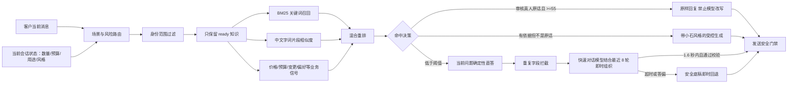

# 小石客服 Skill 与 RAG 产品规格 v4

## 产品结果

小石不是一个只会套话的“售前机器人”，而是一套有证据、有边界、可复核的伴手礼客服能力：先理解当前消息承接哪段对话，再从已审核真人样本、正式 SOP 和会话状态中取得依据，由快速模型即时组织小石式微信回复。

## 用户问题

原产品已有聊天导入、训练样本、知识条目和 Agent，但回复层仍有四个明显问题：

1. 检索主要依赖关键词和字面相似度，没有语料级 BM25、业务信号重排和命中解释。
2. 命中小石真人原话后仍可能被模型二次润色，导致“真人样本进去了，回答却不像真人”。
3. 运营人员无法在发送前直接测试“这句话会命中什么、为什么命中、最终怎么回”。
4. 客户连续追问款式、价格等当前问题时，系统可能只顾收集字段，换句话重复问数量或预算。

## 目标用户与核心任务

- 客服主管：导入、复核、停用知识，确认哪些样本真正代表小石。
- 一线客服：查看系统建议回复和知识依据，需要时接管。
- 产品运营：用测试集检查命中率、原话保持率、错误承诺率和转人工率。
- 客户：得到简短、自然、不重复追问的伴手礼咨询回复。

## 小石回答原则

- 客户问得短，小石也短答。
- 每轮先判断客户是在询问、补充、纠正、拒绝还是催促，以及它承接上一轮的哪一点。
- 安全底稿提供事实和动作，不作为固定文案直接复读；正常情况下由快速模型结合最近对话重新组织。
- 先回答客户当前问的款式、价格、库存、交期、定制或样品问题，再决定是否追问。
- 一轮通常只追问一个关键缺口。
- 客户已经说过的数量、预算、场景和偏好不重复询问。
- 同一需求里同一缺失字段最多问一次；客户暂时不答时先给方案，不换句话继续问。
- 客户觉得贵时问预算并允许调整组合，不解释成本，不承诺最低价。
- 客户否定商品风格时，把否定意见翻译成正向偏好。
- 客户明确放弃时简短收口，不继续追销。
- “咱这边、呀、哈、好呢、哦哦”是可选语气，不是每句必加的模板。

## RAG 链路

检索策略标识为 `hybrid_bm25_chargram_state_rerank_v3_context`：

- BM25 负责关键词稀有度和语料相关性。
- 中文二元、三元片段余弦相似度负责处理少字、表情删除和近似说法。
- 业务信号负责识别询价、价格异议、数量、预算、搭配变更、风格偏好、放弃购买及节日场景。
- 已确认的用途和风格作为有限上下文重排信号，不能单独把无关知识推成可原样回复。
- 客户明确切换用途场景时建立状态隔离点，旧数量、旧预算和旧风格不再继承，也不能在后续轮次复活。
- 质量分和已审核真人来源用于重排，不允许仅靠质量分命中无关知识。
- 相同回复会去重，避免前三条都是“您要多少份呀”。
- 款式、价格、库存、交期、Logo、样品和包装等常见问题优先走确定性直答，跳过不必要的模型等待。
- 最近六轮内已追问过的同一缺失字段会被语义拦截；客户之后只回复“10份”等短答案，仍能从更早的待回答问题恢复上下文。
- 快速对话层读取最近 8 轮、已确认字段、当轮意图和禁止追问项；日常低风险对话优先使用 economy 模型。
- 快速生成预算为 3500ms，不重试、不做二次修复；这是按当前 `glm-4-flash` 实测约 1.9-2.8 秒响应校准的硬上限。超时、答非所问、虚构事实或重复已知字段时立即返回安全底稿。

## 阈值与决策

| 分数 | 决策 | 产品行为 |
|---|---|---|
| 78 及以上 | 高置信 | 优先使用知识；真人原话满足安全条件时原样返回 |
| 55–77 | 中置信 | 真人原话可原样返回；普通 SOP 作为受控生成依据 |
| 32–54 | 低置信 | 只作为参考，不冒充真人原话 |
| 32 以下 | 无命中 | 使用小石式安全追问，不生成动态业务事实 |

## 知识治理

- `ready`：可以参与 RAG。
- `review`：只在运营后台可见，不进入默认检索。
- `rejected`：禁用，不参与 Skill 和 RAG。
- 真人原话必须同时满足：聊天导入来源、复核说明标明脱敏原话、回复正文无附件/引用/直接身份信息、检索分不低于 55。
- 价格、库存、交期、运费、付款、赠品和赔付属于动态事实，必须来自当前商品库、订单或人工确认。

## 运营测试台

知识库运营页新增“小石 RAG 测试台”，支持查看：

- 路由场景和 Agent；
- 已应用的小石 Skill；
- RAG 决策、最高分和命中置信度；
- 每条知识的 BM25、中文相似度、业务信号和真人原话标记；
- 最终建议回复；
- 是否触发“小石原话保护”。

测试台只读取知识，不创建会话、不入发送队列、不调用企业微信。

## v4 验收指标

- 已审核小石代表性问题原话命中率：8/8。
- 已审核原话保持率：100%，命中后不做模型二次改写。
- 待复核知识默认召回率：0%。
- 无关高质量知识误命中：0（专项测试）。
- 未核实价格、库存、交期、到账、赔付自动承诺：0。
- 真人原话问句的决策权归属：`reviewed_human_verbatim`，不被确定性追问路径覆盖。
- 客户当前问题优先直答；同一需求的同一缺失字段连续重复追问率为 0（专项回归）。
- 重复追问被拦截后，客户延迟补充数量或预算仍能承接到下一字段。
- 常见低风险问答正常链路的回复权归属为 `contextual_ai_conversation`，说法可随最近对话变化，而不是固定字符串。
- 快速模型单次预算不超过 3500ms；不可用时仍能安全返回，不阻塞发送队列。
- 已请求取消的发送任务：即使稍后收到明确 API 失败，也不得被低价值自动重试重新发送。
- 客服核心回归、API 构建、Web 类型检查必须通过。

## 后续产品迭代

1. 累计 300 条以上已审核小石样本后，按行业、节日、预算段和采购数量建立分层评测集。
2. 在 PostgreSQL 正式环境接入可审计的向量字段和离线 embedding 作业；当前 v1 是无需外部模型的本地混合 RAG，不虚构为已部署的语义向量服务。
3. 增加线上反馈闭环：采纳、改写、人工接管、客户继续回复、成交与否分别记录，不能只用“发送成功”评价回答质量。
4. 真实企业微信上线前单独验证回调、消息同步、发送接口和客户手机收件；本地 RAG 验收不能替代生产送达证据。
